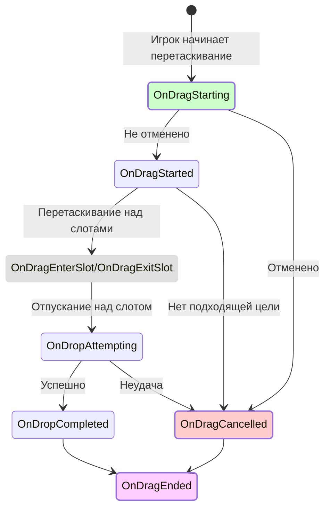
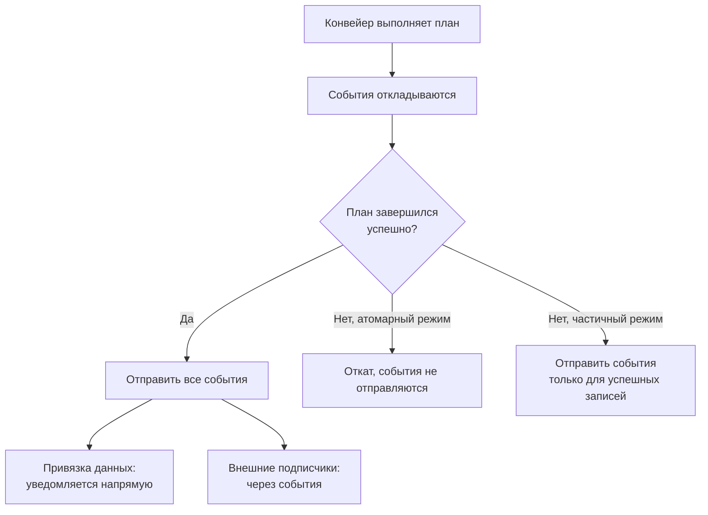

# Справочник событий

Все события, предоставляемые `DragAndDropManager` и `UniversalInventory`.

---

## События жизненного цикла перетаскивания

---

## События DragAndDropManager

### Перетаскивание

| Событие | Когда срабатывает | Примечание |
|---------|-------------------|------------|
| `OnDragStarting` | Перед началом перетаскивания | Можно отменить через правила |
| `OnDragStarted` | Перетаскивание подтверждено | `DragContext` доступен |
| `OnDragEnterSlot` | Курсор входит в слот | Информация о целевом слоте |
| `OnDragExitSlot` | Курсор покидает слот | Информация о предыдущем слоте |
| `OnDropAttempting` | Перед выполнением сброса | Цель определена |
| `OnDropCompleted` | Сброс выполнен успешно | Информация о результате |
| `OnDragCancelled` | Перетаскивание отменено или не удалось | Причина отмены |
| `OnDragEnded` | Цикл перетаскивания завершён | Срабатывает всегда, в конце |

### Автоперенос

| Событие | Когда срабатывает |
|---------|-------------------|
| `OnAutoTransferAttempting` | Перед быстрым переносом по клику |
| `OnAutoTransferCompleted` | Быстрый перенос выполнен |
| `OnAutoTransferFailed` | Быстрый перенос не удался |

### Обмен (swap)

| Событие | Когда срабатывает | Примечание |
|---------|-------------------|------------|
| `OnSwapAttempting` | Перед выполнением обмена | Установите `Cancel = true` для отмены |
| `OnSwapCompleted` | Обмен выполнен | Оба предмета поменялись местами |

---

## События инвентаря

События `UniversalInventory`, срабатывающие при изменении содержимого.

| Событие | Когда срабатывает | Контекст |
|---------|-------------------|----------|
| `OnItemAdded` | Предмет добавлен в инвентарь | `InventoryItemEventContext` |
| `OnItemRemoved` | Предмет удалён из инвентаря | `InventoryItemEventContext` |

### Поля InventoryItemEventContext

| Поле | Тип | Описание |
|------|-----|----------|
| `Item` | `IInventoryItem` | Затронутый предмет |
| `Count` | `int` | Количество добавленных/удалённых |
| `SlotIndex` | `int` | Индекс целевого/исходного слота |
| `SourceInventory` | `IInventory` | Откуда взяли предмет (null если не из другого инвентаря) |
| `TargetInventory` | `IInventory` | Куда положили предмет (null если не в другой инвентарь) |
| `SourceSlot` | `ISlot` | Слот-источник (null если неизвестен) |
| `TargetSlot` | `ISlot` | Слот-назначение (null если неизвестен) |

---

## Контекст обмена

### Поля InventorySwapContext

| Поле | Тип | Описание |
|------|-----|----------|
| `SourceStack` | `ItemStack` | Стак из исходного слота (будет перемещён в целевой) |
| `TargetStack` | `ItemStack` | Стак из целевого слота (будет перемещён в исходный) |
| `SourceSlot` | `ISlot` | Исходный слот (откуда начали перетаскивание) |
| `TargetSlot` | `ISlot` | Целевой слот (куда хотим бросить) |
| `SourceInventory` | `IInventory` | Исходный инвентарь |
| `TargetInventory` | `IInventory` | Целевой инвентарь |
| `Cancel` | `bool` | Установите в `true` чтобы отменить обмен |

---

## Когда отправляются события

!!! info "Безопасность по умолчанию"
    В атомарном режиме ни одно событие не отправляется, пока вся операция не завершится успешно. Это предотвращает реакцию подписчиков на изменения, которые могут быть откачены.
