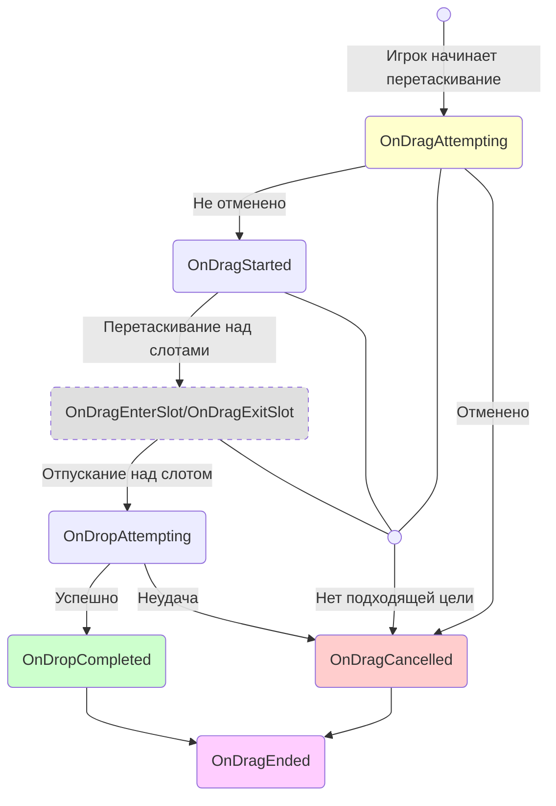
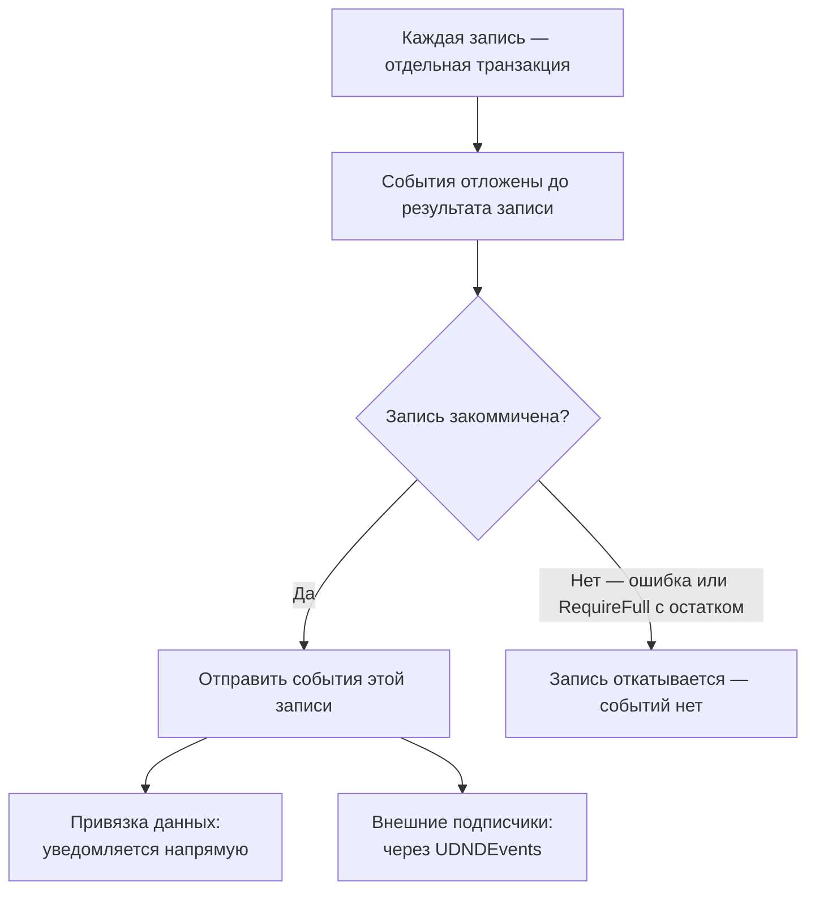

# Справочник событий

Глобальные события drag / drop / авто-переноса / обмена живут в `UDNDEvents`; события изменения содержимого конкретного инвентаря — в `UniversalInventory`.

---

## События жизненного цикла перетаскивания

---

## Глобальные события (`UDNDEvents`)

Это `static`-события. Подписка — `UDNDEvents.OnX += handler` (и отписка в teardown); поднимает их `DragAndDropManager`. Подписчики из прошлой сессии автоматически очищаются на старте каждой Play-сессии (безопасно для Fast Enter Play Mode).

### Перетаскивание

| Событие | Когда срабатывает | Примечание |
|---------|-------------------|------------|
| `OnDragAttempting` | Перед началом перетаскивания | Можно отменить через правила |
| `OnDragStarted` | Перетаскивание подтверждено | `DragContext` доступен |
| `OnDragEnterSlot` | Курсор входит в слот | Информация о целевом слоте |
| `OnDragExitSlot` | Курсор покидает слот | Информация о предыдущем слоте |
| `OnDropAttempting` | Перед выполнением сброса | Цель определена |
| `OnDropCompleted` | Сброс выполнен успешно | Информация о результате |
| `OnDragCancelled` | Перетаскивание отменено или не удалось | Причина отмены |
| `OnDragStackChanged` | Стек в drag context изменился (split drop) | Используйте для обновления UI |
| `OnDragEnded` | Цикл перетаскивания завершён | Срабатывает всегда, в конце |

### Автоперенос

| Событие | Когда срабатывает |
|---------|-------------------|
| `OnAutoTransferAttempting` | Перед быстрым переносом по клику |
| `OnAutoTransferCompleted` | Быстрый перенос выполнен |
| `OnAutoTransferFailed` | Быстрый перенос не удался |

### Обмен (swap)

| Событие | Когда срабатывает | Примечание |
|---------|-------------------|------------|
| `OnSwapAttempting` | Перед выполнением обмена | Установите `Cancel = true` для отмены |
| `OnSwapCompleted` | Обмен выполнен | Слоты уже содержат итоговые target-side стеки |

---

## События инвентаря

События `UniversalInventory`, срабатывающие при изменении содержимого.

| Событие | Когда срабатывает | Контекст |
|---------|-------------------|----------|
| `OnItemAdded` | Предмет добавлен в инвентарь | `InventoryItemEventContext` |
| `OnItemRemoved` | Предмет удалён из инвентаря | `InventoryItemEventContext` |

### Поля InventoryItemEventContext

| Поле | Тип | Описание |
|------|-----|----------|
| `Stack` | `ItemStack` | Полный стек события |
| `SlotIndex` | `int` | Индекс целевого/исходного слота |
| `SourceInventory` | `IInventory` | Откуда взяли предмет (null если не из другого инвентаря) |
| `TargetInventory` | `IInventory` | Куда положили предмет (null если не в другой инвентарь) |
| `SourceSlot` | `BaseSlot` | Слот-источник (null если неизвестен) |
| `TargetSlot` | `BaseSlot` | Слот-назначение (null если неизвестен) |

Практически:

- `context.Stack.PrimaryAdapter` даёт representative adapter
- `context.Stack.Count` даёт количество
- для cross-inventory переноса remove обычно публикует stack до conversion, а add — stack после conversion

---

## Контекст обмена

### Поля InventorySwapContext

| Поле | Тип | Описание |
|------|-----|----------|
| `SourceStack` | `ItemStack` | Pre-commit стак из исходного слота |
| `TargetStack` | `ItemStack` | Pre-commit стак из целевого слота |
| `SourceSlot` | `BaseSlot` | Исходный слот (откуда начали перетаскивание) |
| `TargetSlot` | `BaseSlot` | Целевой слот (куда хотим бросить) |
| `SourceInventory` | `IInventory` | Исходный инвентарь |
| `TargetInventory` | `IInventory` | Целевой инвентарь |
| `Cancel` | `bool` | Установите в `true` чтобы отменить обмен |

Важно:

- для cross-inventory swap это не обязательно те же adapter-объекты, которые будут лежать в слотах после commit
- итоговые слоты уже содержат target-side converted stacks

---

## Когда отправляются события

Сервис переноса выполняет каждую запись как отдельную транзакцию (последовательный best-effort батч). Внутри записи события и уведомления привязки данных откладываются до тех пор, пока не станет известен её исход, и отправляются только при коммите.

!!! info "Безопасность по умолчанию"
    События срабатывают только после коммита записи, когда её изменения уже реальны. Неудавшаяся запись восстанавливает свои снапшоты и не отправляет ничего, поэтому подписчики никогда не реагируют на откаченные изменения. Записи независимы: более поздняя ошибка не откатывает уже закоммиченные записи (best-effort батч).

См. также:

- [Конвейер переноса](../architecture/transfer-pipeline.md)
- [Логи и отладка](logs-and-debugging.md)
