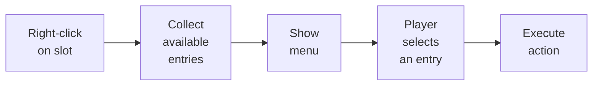

# Context Menu

The context menu displays a list of actions on right-click (or long press) on an inventory slot. Menu entries are configured via ScriptableObject presets and can differ for each inventory.

---

## How It Works



The system automatically filters entries via `CanShow()` --- only actions applicable to the current slot appear in the menu. Entries are sorted by the `Order` field.

---

## Setup

1. **Add `ContextMenuManager`** to the scene (singleton). Assign it the menu view prefab.
2. **Create a preset** via the menu: *Create > DragAndDrop > ContextMenu > Preset*. Add the desired entries to it.
3. **Add `ContextMenuBinder`** to the inventory GameObject. Assign a preset for non-empty slots and (optionally) a separate preset for empty slots.
4. **Bind the action** `ShowContextMenuAction` to the right mouse button (or long press) in `InteractionBindingsProfile`.

---

## Custom Menu Entry

Create a ScriptableObject by inheriting from `ContextMenuEntryDefinitionSO`:

```csharp
[CreateAssetMenu(menuName = "Game/Context Menu/Use Item")]
public class UseItemEntry : ContextMenuEntryDefinitionSO
{
    public override bool CanShow(ContextMenuContext ctx)
    {
        // Show only if there is an item
        return ctx.Item != null;
    }

    public override void Execute(ContextMenuContext ctx)
    {
        // Your item usage logic
        Debug.Log($"Using: {ctx.Item.DisplayName}");
    }
}
```

Then create an asset via *Create* and add it to the menu preset.

---

## Built-in Entries

| Entry | Description |
|-------|-------------|
| **Debug** | Outputs item information to the console (name, quantity) |
| **Sort** | Sorts items in the inventory (by name, category, rarity) |

---

## Context

When `Execute()` and `CanShow()` are called, you receive a `ContextMenuContext` struct with full information:

| Field | Type | Description |
|-------|------|-------------|
| `Slot` | `BaseSlot` | The slot on which the menu was invoked |
| `Item` | `IItemAdapter` | The item in the slot (null if empty) |
| `ItemCount` | `int` | Number of items in the stack |
| `Inventory` | `UniversalInventory` | The inventory that owns the slot |
| `ScreenPosition` | `Vector2` | Screen position of the click |
| `InputSource` | `FocusSource` | Input source (mouse / gamepad) |

Menu closing is handled automatically via `ContextMenuManager.Instance.Hide()`.

---

## Class Reference

| Class | Role |
|-------|------|
| `ContextMenuManager` | Singleton manager: shows/hides the menu |
| `ContextMenuPreset` | ScriptableObject preset with a list of entries |
| `ContextMenuBinder` | Binds presets to an inventory |
| `ContextMenuEntryDefinitionSO` | Base SO for a menu entry (inherit from it) |
| `IContextMenuEntry` | Interface for a menu entry |
| `ContextMenuContext` | Struct with invocation context data |
| `ContextMenuViewBase` | Base class for the menu view (implement your own) |
| `UniversalContextMenuView` | Ready-made UGUI menu view implementation |
| `ShowContextMenuAction` | Action for binding to PointerBinding |
