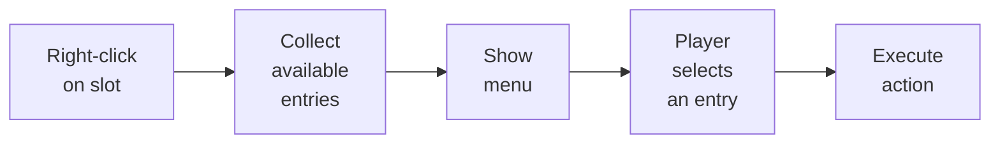

# Context Menu

El context menu muestra una lista de acciones al hacer clic derecho (o pulsación larga) sobre un slot del inventario. Las entradas del menú se configuran mediante ScriptableObject presets y pueden ser distintas para cada inventario.

---

## Cómo funciona



El sistema filtra automáticamente las entradas a través de `CanShow()`: solo aparecen acciones aplicables al slot actual. Las entradas se ordenan por el campo `Order`.

---

## Configuración

1. **Añade `ContextMenuManager`** a la escena (singleton). Asígnale el prefab de la vista del menú.
2. **Crea un preset** desde el menú: *Create > DragAndDrop > ContextMenu > Preset*. Añádele las entradas deseadas.
3. **Añade `ContextMenuBinder`** al GameObject del inventario. Asigna un preset para slots no vacíos y, opcionalmente, otro para slots vacíos.
4. **Vincula la acción** `ShowContextMenuAction` al botón derecho del ratón (o pulsación larga) en `InteractionBindingsProfile`.

---

## Entrada de menú personalizada

Crea un ScriptableObject heredando de `ContextMenuEntryDefinitionSO`:

```csharp
[CreateAssetMenu(menuName = "Game/Context Menu/Use Item")]
public class UseItemEntry : ContextMenuEntryDefinitionSO
{
    public override bool CanShow(ContextMenuContext ctx)
    {
        // Show only if there is an item
        return ctx.Item != null;
    }

    public override void Execute(ContextMenuContext ctx)
    {
        // Your item usage logic
        Debug.Log($"Using: {ctx.Item.DisplayName}");
    }
}
```

Después crea el asset desde *Create* y añádelo al preset del menú.

---

## Entradas incluidas

| Entrada | Descripción |
|-------|-------------|
| **Debug** | Imprime información del item en la consola (nombre, cantidad) |
| **Sort** | Ordena los items del inventario (por nombre, categoría, rareza) |

---

## Contexto

Cuando se llaman `Execute()` y `CanShow()`, recibes una estructura `ContextMenuContext` con toda la información:

| Campo | Tipo | Descripción |
|-------|------|-------------|
| `Slot` | `BaseSlot` | El slot sobre el que se invocó el menú |
| `Item` | `IItemAdapter` | El item del slot (null si está vacío) |
| `ItemCount` | `int` | Número de items en el stack |
| `Inventory` | `UniversalInventory` | El inventario propietario del slot |
| `ScreenPosition` | `Vector2` | Posición en pantalla del clic |
| `InputSource` | `FocusSource` | Fuente de input (mouse / gamepad) |

El cierre del menú se gestiona automáticamente mediante `ContextMenuManager.Instance.Hide()`.

---

## Referencia de clases

| Clase | Rol |
|-------|------|
| `ContextMenuManager` | Singleton manager: muestra/oculta el menú |
| `ContextMenuPreset` | ScriptableObject preset con una lista de entradas |
| `ContextMenuBinder` | Vincula presets a un inventario |
| `ContextMenuEntryDefinitionSO` | SO base para una entrada de menú (hereda de él) |
| `IContextMenuEntry` | Interface de una entrada de menú |
| `ContextMenuContext` | Struct con datos del contexto de invocación |
| `ContextMenuViewBase` | Clase base para la vista del menú (implementa la tuya) |
| `UniversalContextMenuView` | Implementación UGUI lista para usar |
| `ShowContextMenuAction` | Acción para vincular a PointerBinding |

