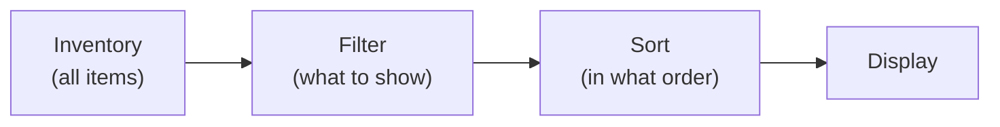

# Filtering and Sorting

The filtering and sorting system allows controlling the display of items in an inventory without changing the data itself. Items remain in their places --- only how they are shown to the player changes.

---

## General Scheme



> Inventory data is not modified. Filtering and sorting only affect the visibility and order of slots in the UI.

---

## Filter Modes

When an item does not pass the filter, it can be handled in one of three ways:

| Mode | What Happens |
|------|--------------|
| **Hide** | The slot is hidden (`SetActive(false)`) |
| **Dim** | The slot remains visible but becomes inactive (dimmed, non-clickable) |
| **MoveToEnd** | The slot is moved to the end of the list and becomes inactive |

---

## Filter Types

| Filter | Description | Item Requirement |
|--------|-------------|------------------|
| **By category** | Show only items of a given category (Weapon, Armor...) | `IFilterable` |
| **By rarity** | Show items within a rarity range (min--max) | `IFilterable` |
| **By name** | Text search by item name | --- |
| **Custom** | Arbitrary predicate `Predicate<IInventoryItem>` | --- |

---

## Sort Modes

| Mode | Sorts by | Item Requirement |
|------|----------|------------------|
| **ByName** | `DisplayName` | --- |
| **ByCategory** | `IFilterable.Category` | `IFilterable` |
| **ByRarity** | `IFilterable.Rarity` | `IFilterable` |
| **BySortValue** | `ISortable.SortValue` | `ISortable` |
| **Custom** | Arbitrary `Comparison<ISlot>` | --- |

All modes support ascending and descending sorting.

---

## Setup via Inspector

1. **Add `FilterSortController`** to the inventory GameObject.
2. **Create presets** via the menu:
    - *Create > DragAndDrop > Filter > Filter Preset* --- for filtering.
    - *Create > DragAndDrop > Filter > Sort Preset* --- for sorting.
3. **Add buttons** with `FilterButton` and `SortButton` components. Assign presets and the controller.

---

## Code Example

```csharp
var controller = inventory.GetComponent<FilterSortController>();

// Filter: show only weapons
controller.SetCategoryFilter("Weapon");

// Sort: by rarity, from rare to common
controller.SetSortMode(FilterSortController.SortMode.ByRarity, ascending: false);

// Reset all
controller.ClearAll();

// Custom filter
controller.SetFilter(item => item is IFilterable f && f.Rarity >= 3);
```

---

## Presets

Presets allow configuring filters and sorting in the Inspector and switching them with buttons:

- **FilterPreset** --- stores the filter type and parameters (category, rarity range, search text).
- **SortPreset** --- stores the sort mode and direction.
- **FilterButton** --- on click, applies/resets the filter preset. Supports toggle mode.
- **SortButton** --- on click, applies/resets the sort preset. Can toggle direction.

---

## Class Reference

| Class | Role |
|-------|------|
| `FilterSortController` | Controller: applies filter and sorting to an inventory |
| `FilterPreset` | ScriptableObject filter preset |
| `SortPreset` | ScriptableObject sort preset |
| `FilterButton` | Filter button component |
| `SortButton` | Sort button component |
| `IFilterable` | Item interface: Category, Subcategory, Rarity |
| `ISortable` | Item interface: SortValue, SortName |
