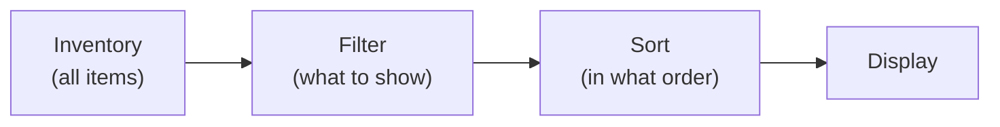

# Filtering and Sorting

The filtering and sorting system allows controlling the display of items in an inventory without changing the data itself. Items remain in their places --- only how they are shown to the player changes.

---

## General Scheme



> Inventory data is not modified. Filtering and sorting only affect the visibility and order of slots in the UI.

---

## Filter Modes

When an item does not pass the filter, it can be handled in one of three ways:

| Mode | What Happens |
|------|--------------|
| **Hide** | The slot is hidden (`SetActive(false)`) |
| **Dim** | The slot remains visible but becomes inactive (dimmed, non-clickable) |
| **MoveToEnd** | The slot is moved to the end of the list and becomes inactive |

---

## Built-in Filters

All filters are `[Serializable]` classes implementing `ISlotFilter`. They can be embedded via `[SerializeReference]` in any MonoBehaviour or ScriptableObject:

| Filter | Description | Item Requirement |
|--------|-------------|------------------|
| `CategoryFilter` | Show only items of a given category | `IFilterable` |
| `RarityRangeFilter` | Show items within a rarity range (min--max) | `IFilterable` |
| `NameSearchFilter` | Substring search by item name | --- |
| `CompositeFilter` | Combines multiple filters with AND/OR logic | --- |

---

## Built-in Sorters

All sorters are `[Serializable]` classes implementing `ISlotSorter`:

| Sorter | Sorts by | Item Requirement |
|--------|----------|------------------|
| `NameSorter` | `DisplayName` | --- |
| `CategorySorter` | `IFilterable.Category` | `IFilterable` |
| `RaritySorter` | `IFilterable.Rarity` | `IFilterable` |
| `SortValueSorter` | `ISortable.SortValue` | `ISortable` |
| `StackCountSorter` | Stack count | --- |
| `CompositeSorter` | Chain of sorters (first non-zero result wins) | --- |

All sorters support ascending and descending direction via the controller.

---

## Setup via Inspector

1. **Add `FilterSortController`** to the inventory GameObject.
2. **Create a preset** via *Create > DragAndDrop > Filter > Filter Sort Preset*. Choose a filter and/or sorter via the `[SerializeReference]` picker.
3. **Add buttons** with the `FilterSortButton` component. Assign the preset and the controller.

---

## Code Examples

```csharp
var controller = inventory.GetComponent<FilterSortController>();

// Use a [Serializable] filter instance
var filter = new CategoryFilter { Category = "Weapon" };
controller.SetFilter(filter);

// Sort with a [Serializable] sorter
controller.SetSorter(new RaritySorter(), ascending: false);

// Reset all
controller.ClearAll();

// Lambda filter (captures live values)
controller.SetFilter((in FilterContext ctx) =>
{
    if (ctx.Slot.Stack?.PrimaryAdapter is not IFilterable f) return false;
    return f.Rarity >= minRaritySlider.value;
});

// After changing fields on the active filter at runtime:
((CategoryFilter)controller.ActiveFilter).Category = "Armor";
controller.Refresh();
```

---

## Presets and Buttons

- **FilterSortPreset** --- a single ScriptableObject combining filter + sorter + display mode + direction. Configured entirely via `[SerializeReference]` pickers in the Inspector.
- **FilterSortButton** --- universal UI button. On click applies/resets a preset. Supports toggle mode and direction toggle. Stateless: reads all visual state from the controller.

---

## Class Reference

| Class | Role |
|-------|------|
| `ISlotFilter` | Core filter interface (`Evaluate(in FilterContext)`) |
| `ISlotSorter` | Core sorter interface (`Compare(in FilterContext, in FilterContext)`) |
| `FilterContext` | Context struct: Slot, Inventory, AllSlots, SlotIndex |
| `FilterSortController` | Controller: applies filter and sorting to an inventory |
| `FilterSortPreset` | ScriptableObject: combined filter + sort preset |
| `FilterSortButton` | Universal filter/sort button component |
| `SlotFilterSO` | ScriptableObject wrapper for shareable filter assets |
| `SlotSorterSO` | ScriptableObject wrapper for shareable sorter assets |
| `IFilterable` | Item interface: Category, Subcategory, Rarity |
| `ISortable` | Item interface: SortValue, SortName |
