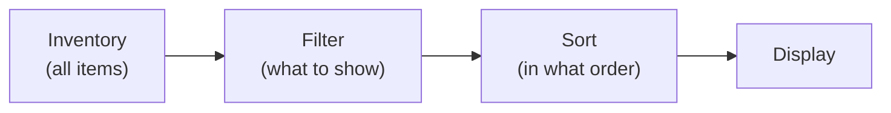

# Filtering and Sorting

El sistema de filtrado y ordenación permite controlar cómo se muestran los items dentro de un inventario sin modificar los datos en sí. Los items permanecen en su sitio; solo cambia la forma en que se muestran al jugador.

---

## Esquema general



> Los datos del inventario no se modifican. El filtrado y la ordenación solo afectan a la visibilidad y al orden de los slots en la UI.

---

## Modos de filtro

Cuando un item no pasa el filtro, puede tratarse de una de estas tres maneras:

| Modo | Qué ocurre |
|------|--------------|
| **Hide** | El slot se oculta (`SetActive(false)`) |
| **Dim** | El slot sigue visible pero se vuelve inactivo (atenuado, no clicable) |
| **MoveToEnd** | El slot se mueve al final de la lista y se vuelve inactivo |

---

## Tipos de filtro

| Filtro | Descripción | Requisito del item |
|--------|-------------|------------------|
| **By category** | Mostrar solo items de una categoría dada (Weapon, Armor...) | `IFilterable` |
| **By rarity** | Mostrar items dentro de un rango de rareza (min--max) | `IFilterable` |
| **By name** | Búsqueda de texto por nombre del item | --- |
| **Custom** | Predicado arbitrario `Predicate<IItemAdapter>` | --- |

---

## Modos de ordenación

| Modo | Ordena por | Requisito del item |
|------|----------|------------------|
| **ByName** | `DisplayName` | --- |
| **ByCategory** | `IFilterable.Category` | `IFilterable` |
| **ByRarity** | `IFilterable.Rarity` | `IFilterable` |
| **BySortValue** | `ISortable.SortValue` | `ISortable` |
| **Custom** | `Comparison<BaseSlot>` arbitrario | --- |

Todos los modos soportan orden ascendente y descendente.

---

## Configuración desde el Inspector

1. **Añade `FilterSortController`** al GameObject del inventario.
2. **Crea presets** desde el menú:
    - *Create > DragAndDrop > Filter > Filter Preset* — para filtrado.
    - *Create > DragAndDrop > Filter > Sort Preset* — para ordenación.
3. **Añade botones** con componentes `FilterButton` y `SortButton`. Asigna presets y el controller.

---

## Ejemplo de código

```csharp
var controller = inventory.GetComponent<FilterSortController>();

// Filter: show only weapons
controller.SetCategoryFilter("Weapon");

// Sort: by rarity, from rare to common
controller.SetSortMode(FilterSortController.SortMode.ByRarity, ascending: false);

// Reset all
controller.ClearAll();

// Custom filter
controller.SetFilter(item => item is IFilterable f && f.Rarity >= 3);
```

---

## Presets

Los presets permiten configurar filtrado y ordenación desde el Inspector y cambiarlos con botones:

- **FilterPreset** — guarda el tipo de filtro y sus parámetros (categoría, rango de rareza, texto de búsqueda).
- **SortPreset** — guarda el modo de ordenación y la dirección.
- **FilterButton** — al hacer clic, aplica/restablece el filter preset. Soporta toggle mode.
- **SortButton** — al hacer clic, aplica/restablece el sort preset. Puede alternar la dirección.

---

## Referencia de clases

| Clase | Rol |
|-------|------|
| `FilterSortController` | Controller: aplica filtro y ordenación a un inventario |
| `FilterPreset` | ScriptableObject filter preset |
| `SortPreset` | ScriptableObject sort preset |
| `FilterButton` | Componente de botón de filtro |
| `SortButton` | Componente de botón de ordenación |
| `IFilterable` | Interface de item: Category, Subcategory, Rarity |
| `ISortable` | Interface de item: SortValue, SortName |

