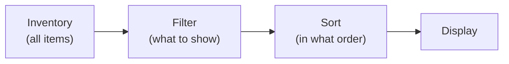

# Filtering and Sorting

El sistema de filtrado y ordenación permite controlar cómo se muestran los items dentro de un inventario sin modificar los datos en sí. Los items permanecen en su sitio; solo cambia la forma en que se muestran al jugador.

---

## Esquema general



> Los datos del inventario no se modifican. El filtrado y la ordenación solo afectan a la visibilidad y al orden de los slots en la UI.

---

## Modos de filtro

Cuando un item no pasa el filtro, puede tratarse de una de estas tres maneras:

| Modo | Qué ocurre |
|------|--------------|
| **Hide** | El slot se oculta (`SetActive(false)`) |
| **Dim** | El slot sigue visible pero se vuelve inactivo (atenuado, no clicable) |
| **MoveToEnd** | El slot se mueve al final de la lista y se vuelve inactivo |

---

## Filtros integrados

Todos los filtros son clases `[Serializable]` que implementan `ISlotFilter`. Se integran mediante `[SerializeReference]` en cualquier MonoBehaviour o ScriptableObject:

| Filtro | Descripción | Requisito del item |
|--------|-------------|------------------|
| `CategoryFilter` | Mostrar solo items de una categoría dada | `IFilterable` |
| `RarityRangeFilter` | Mostrar items dentro de un rango de rareza (min--max) | `IFilterable` |
| `NameSearchFilter` | Búsqueda de subcadena por nombre del item | --- |
| `CompositeFilter` | Combina múltiples filtros con lógica AND/OR | --- |

---

## Sorters integrados

Todos los sorters son clases `[Serializable]` que implementan `ISlotSorter`:

| Sorter | Ordena por | Requisito del item |
|--------|----------|------------------|
| `NameSorter` | `DisplayName` | --- |
| `CategorySorter` | `IFilterable.Category` | `IFilterable` |
| `RaritySorter` | `IFilterable.Rarity` | `IFilterable` |
| `SortValueSorter` | `ISortable.SortValue` | `ISortable` |
| `StackCountSorter` | Cantidad en el stack | --- |
| `CompositeSorter` | Cadena de sorters (gana el primer resultado distinto de cero) | --- |

Todos los sorters soportan orden ascendente y descendente mediante el controller.

---

## Configuración desde el Inspector

1. **Añade `FilterSortController`** al GameObject del inventario.
2. **Crea assets de filtro/sorter**:
    - *Create > DragAndDrop > Filter > Slot Filter* --- asset de filtro (`SlotFilterSO`). Elige el tipo de filtro mediante el picker de `[SerializeReference]`.
    - *Create > DragAndDrop > Filter > Slot Sorter* --- asset de sorter (`SlotSorterSO`).
    - *Create > DragAndDrop > Filter > Filter Sort Preset* --- preset combinado (`FilterSortPreset`) con filtro + sorter + modo de visualización.
3. **Añade botones**:
    - `FilterButton` --- aplica un `SlotFilterSO` al hacer clic.
    - `SortButton` --- aplica un `SlotSorterSO` al hacer clic. Soporta alternancia de dirección.
    - `FilterSortButton` --- aplica un `FilterSortPreset` combinado al hacer clic.

---

## Ejemplo de código

```csharp
var controller = inventory.GetComponent<FilterSortController>();

// Usar una instancia [Serializable] de filtro
var filter = new CategoryFilter { Category = "Weapon" };
controller.SetFilter(filter);

// Ordenar con un sorter [Serializable]
controller.SetSorter(new RaritySorter(), ascending: false);

// Restablecer todo
controller.ClearAll();

// Filtro lambda (captura valores en vivo)
controller.SetFilter((in FilterContext ctx) =>
{
    if (ctx.Slot.Stack?.PrimaryAdapter is not IFilterable f) return false;
    return f.Rarity >= minRaritySlider.value;
});

// Tras cambiar campos del filtro activo en runtime:
((CategoryFilter)controller.ActiveFilter).Category = "Armor";
controller.Refresh();
```

---

## Assets y botones

- **SlotFilterSO** --- ScriptableObject que envuelve un `ISlotFilter`. Usado por `FilterButton`.
- **SlotSorterSO** --- ScriptableObject que envuelve un `ISlotSorter`. Usado por `SortButton`.
- **FilterSortPreset** --- ScriptableObject que combina filtro + sorter + modo de visualización + dirección. Usado por `FilterSortButton`.
- **FilterButton** --- botón de UI que aplica/restablece un `SlotFilterSO`. Soporta toggle mode.
- **SortButton** --- botón de UI que aplica/restablece un `SlotSorterSO`. Soporta toggle mode y alternancia de dirección.
- **FilterSortButton** --- botón de UI que aplica/restablece un `FilterSortPreset` combinado. Soporta toggle mode y alternancia de dirección.

---

## Referencia de clases

| Clase | Rol |
|-------|------|
| `ISlotFilter` | Interface base de filtro (`Evaluate(in FilterContext)`) |
| `ISlotSorter` | Interface base de sorter (`Compare(in FilterContext, in FilterContext)`) |
| `FilterContext` | Struct de contexto: Slot, Inventory, AllSlots, SlotIndex |
| `FilterSortController` | Controller: aplica filtro y ordenación a un inventario |
| `SlotFilterSO` | SO wrapper para assets de filtro compartibles |
| `SlotSorterSO` | SO wrapper para assets de sorter compartibles |
| `FilterSortPreset` | ScriptableObject: preset combinado de filtro + sort |
| `FilterButton` | Botón de UI para un solo filtro |
| `SortButton` | Botón de UI para un solo sorter |
| `FilterSortButton` | Botón de UI para un preset combinado |
| `IFilterable` | Interface de item: Category, Subcategory, Rarity |
| `ISortable` | Interface de item: SortValue, SortName |
