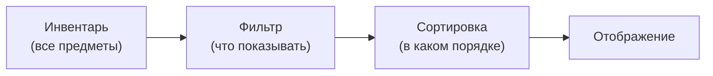

# Фильтрация и сортировка

Система фильтрации и сортировки позволяет управлять отображением предметов в инвентаре без изменения самих данных. Предметы остаются на своих местах --- меняется только то, как они показаны игроку.

---

## Общая схема



> Данные инвентаря не изменяются. Фильтрация и сортировка влияют только на видимость и порядок слотов в UI.

---

## Режимы фильтра

Когда предмет не проходит фильтр, он может быть обработан одним из трёх способов:

| Режим | Что происходит |
|-------|----------------|
| **Скрыть** (Hide) | Слот скрывается (`SetActive(false)`) |
| **Затемнить** (Dim) | Слот остаётся видимым, но становится неактивным (затемнённый, некликабельный) |
| **Переместить в конец** (MoveToEnd) | Слот сдвигается в конец списка и становится неактивным |

---

## Типы фильтров

| Фильтр | Описание | Требование к предмету |
|--------|----------|----------------------|
| **По категории** | Показать только предметы заданной категории (Weapon, Armor...) | `IFilterable` |
| **По редкости** | Показать предметы в диапазоне редкости (min--max) | `IFilterable` |
| **По имени** | Текстовый поиск по имени предмета | --- |
| **Кастомный** | Произвольный предикат `Predicate<IInventoryItem>` | --- |

---

## Режимы сортировки

| Режим | Сортирует по | Требование к предмету |
|-------|-------------|----------------------|
| **По имени** (ByName) | `DisplayName` | --- |
| **По категории** (ByCategory) | `IFilterable.Category` | `IFilterable` |
| **По редкости** (ByRarity) | `IFilterable.Rarity` | `IFilterable` |
| **По значению** (BySortValue) | `ISortable.SortValue` | `ISortable` |
| **Кастомный** (Custom) | Произвольный `Comparison<ISlot>` | --- |

Все режимы поддерживают сортировку по возрастанию и убыванию.

---

## Настройка через Inspector

1. **Добавьте `FilterSortController`** на GameObject инвентаря.
2. **Создайте пресеты** через меню:
    - *Create > DragAndDrop > Filter > Filter Preset* --- для фильтра.
    - *Create > DragAndDrop > Filter > Sort Preset* --- для сортировки.
3. **Добавьте кнопки** с компонентами `FilterButton` и `SortButton`. Назначьте пресеты и контроллер.

---

## Пример через код

```csharp
var controller = inventory.GetComponent<FilterSortController>();

// Фильтр: показать только оружие
controller.SetCategoryFilter("Weapon");

// Сортировка: по редкости, от редких к обычным
controller.SetSortMode(FilterSortController.SortMode.ByRarity, ascending: false);

// Сбросить всё
controller.ClearAll();

// Кастомный фильтр
controller.SetFilter(item => item is IFilterable f && f.Rarity >= 3);
```

---

## Пресеты

Пресеты позволяют настроить фильтры и сортировку в Inspector и переключать их кнопками:

- **FilterPreset** --- хранит тип фильтра и параметры (категория, диапазон редкости, текст поиска).
- **SortPreset** --- хранит режим сортировки и направление.
- **FilterButton** --- при клике применяет/сбрасывает пресет фильтра. Поддерживает toggle-режим.
- **SortButton** --- при клике применяет/сбрасывает пресет сортировки. Может переключать направление.

---

## Справочник классов

| Класс | Роль |
|-------|------|
| `FilterSortController` | Контроллер: применяет фильтр и сортировку к инвентарю |
| `FilterPreset` | ScriptableObject-пресет фильтра |
| `SortPreset` | ScriptableObject-пресет сортировки |
| `FilterButton` | Компонент кнопки фильтра |
| `SortButton` | Компонент кнопки сортировки |
| `IFilterable` | Интерфейс предмета: Category, Subcategory, Rarity |
| `ISortable` | Интерфейс предмета: SortValue, SortName |
