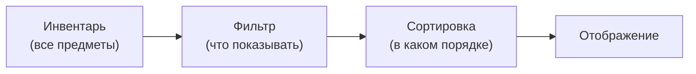

# Фильтрация и сортировка

Система фильтрации и сортировки позволяет управлять отображением предметов в инвентаре без изменения самих данных. Предметы остаются на своих местах --- меняется только то, как они показаны игроку.

---

## Общая схема



> Данные инвентаря не изменяются. Фильтрация и сортировка влияют только на видимость и порядок слотов в UI.

---

## Режимы фильтра

Когда предмет не проходит фильтр, он может быть обработан одним из трёх способов:

| Режим | Что происходит |
|-------|----------------|
| **Скрыть** (Hide) | Слот скрывается (`SetActive(false)`) |
| **Затемнить** (Dim) | Слот остаётся видимым, но становится неактивным (затемнённый, некликабельный) |
| **Переместить в конец** (MoveToEnd) | Слот сдвигается в конец списка и становится неактивным |

---

## Встроенные фильтры

Все фильтры --- `[Serializable]` классы, реализующие `ISlotFilter`. Встраиваются через `[SerializeReference]` в любой MonoBehaviour или ScriptableObject:

| Фильтр | Описание | Требование к предмету |
|--------|----------|----------------------|
| `CategoryFilter` | Показать только предметы заданной категории | `IFilterable` |
| `RarityRangeFilter` | Показать предметы в диапазоне редкости (min--max) | `IFilterable` |
| `NameSearchFilter` | Поиск подстроки по имени предмета | --- |
| `CompositeFilter` | Комбинирует несколько фильтров с логикой AND/OR | --- |

---

## Встроенные сортировщики

Все сортировщики --- `[Serializable]` классы, реализующие `ISlotSorter`:

| Сортировщик | Сортирует по | Требование к предмету |
|-------------|-------------|----------------------|
| `NameSorter` | `DisplayName` | --- |
| `CategorySorter` | `IFilterable.Category` | `IFilterable` |
| `RaritySorter` | `IFilterable.Rarity` | `IFilterable` |
| `SortValueSorter` | `ISortable.SortValue` | `ISortable` |
| `StackCountSorter` | Количество в стаке | --- |
| `CompositeSorter` | Цепочка сортировщиков (первый ненулевой результат побеждает) | --- |

Все сортировщики поддерживают направление (asc/desc) через контроллер.

---

## Настройка через Inspector

1. **Добавьте `FilterSortController`** на GameObject инвентаря.
2. **Создайте пресет** через *Create > DragAndDrop > Filter > Filter Sort Preset*. Выберите фильтр и/или сортировщик через `[SerializeReference]` пикер.
3. **Добавьте кнопки** с компонентом `FilterSortButton`. Назначьте пресет и контроллер.

---

## Примеры через код

```csharp
var controller = inventory.GetComponent<FilterSortController>();

// Использование [Serializable] экземпляра фильтра
var filter = new CategoryFilter { Category = "Weapon" };
controller.SetFilter(filter);

// Сортировка [Serializable] сортировщиком
controller.SetSorter(new RaritySorter(), ascending: false);

// Сбросить всё
controller.ClearAll();

// Лямбда-фильтр (захватывает живые значения)
controller.SetFilter((in FilterContext ctx) =>
{
    if (ctx.Slot.Stack?.PrimaryAdapter is not IFilterable f) return false;
    return f.Rarity >= minRaritySlider.value;
});

// После изменения полей активного фильтра в рантайме:
((CategoryFilter)controller.ActiveFilter).Category = "Armor";
controller.Refresh();
```

---

## Пресеты и кнопки

- **FilterSortPreset** --- единый ScriptableObject, объединяющий фильтр + сортировщик + режим отображения + направление. Настраивается полностью через `[SerializeReference]` пикеры в Inspector.
- **FilterSortButton** --- универсальная UI-кнопка. По клику применяет/сбрасывает пресет. Поддерживает toggle-режим и переключение направления. Stateless: читает всё визуальное состояние из контроллера.

---

## Справочник классов

| Класс | Роль |
|-------|------|
| `ISlotFilter` | Базовый интерфейс фильтра (`Evaluate(in FilterContext)`) |
| `ISlotSorter` | Базовый интерфейс сортировщика (`Compare(in FilterContext, in FilterContext)`) |
| `FilterContext` | Контекст: Slot, Inventory, AllSlots, SlotIndex |
| `FilterSortController` | Контроллер: применяет фильтр и сортировку к инвентарю |
| `FilterSortPreset` | ScriptableObject: комбинированный пресет фильтра + сортировки |
| `FilterSortButton` | Универсальная кнопка фильтра/сортировки |
| `SlotFilterSO` | SO-обёртка для переиспользуемых ассетов фильтров |
| `SlotSorterSO` | SO-обёртка для переиспользуемых ассетов сортировщиков |
| `IFilterable` | Интерфейс предмета: Category, Subcategory, Rarity |
| `ISortable` | Интерфейс предмета: SortValue, SortName |
