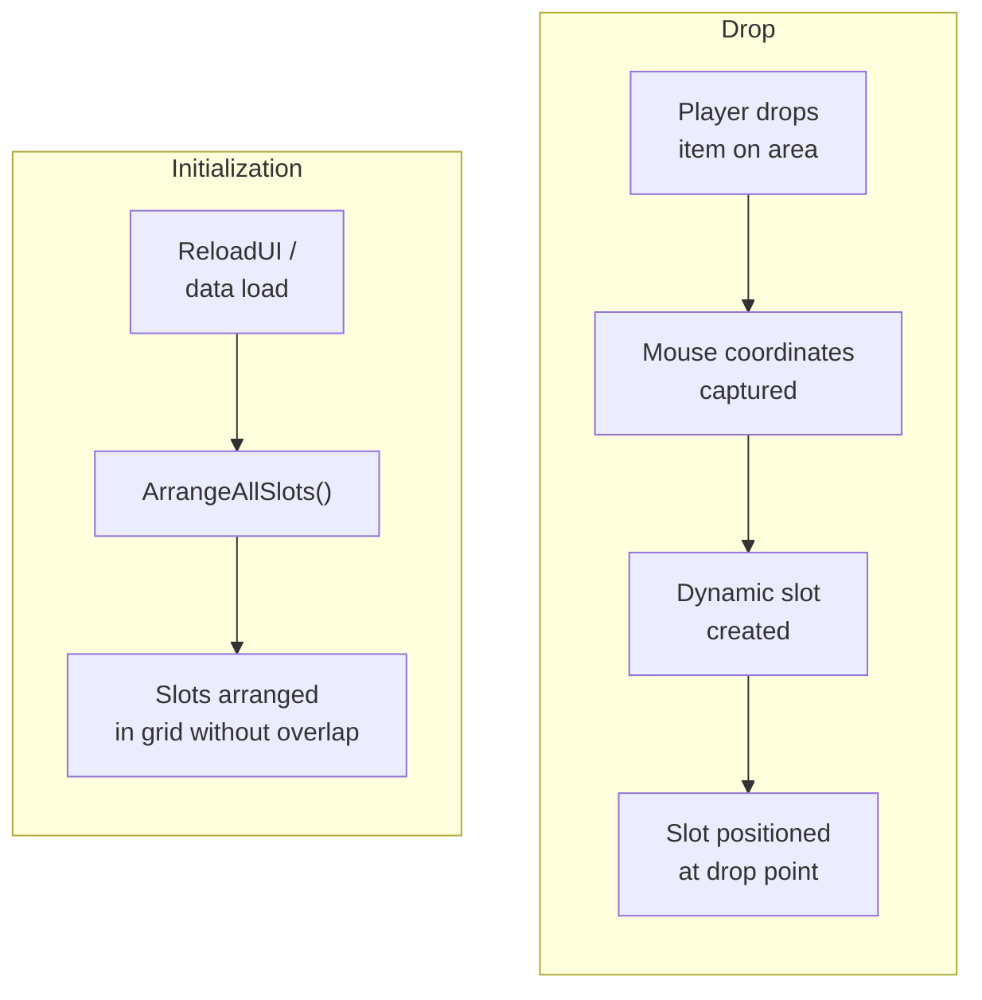
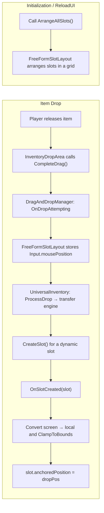

# Example: Free-Form Layout

`FreeFormSlotLayout` is an example component that demonstrates how to build a free-form inventory layout on top of the core drag-and-drop pipeline. Items appear where the player drops them, slots are created dynamically, and overlapping drops are shifted to the nearest free position.

---

## How It Works



Key idea: coordinates are **not passed** through the transfer pipeline (policy / strategy / transfer engine). Positioning is a pure UI concern, solved through two hooks:

1. `DragAndDropManager.OnDropAttempting` --- capture mouse position.
2. `UniversalInventory.OnSlotCreated` --- position the new slot at the captured coordinates.

---

## Components

| Component | Purpose |
|-----------|---------|
| **FreeFormSlotLayout** | Example component: positions dynamically created slots at the drop point during drag, resolves overlap, and arranges them in a grid during initialization |
| **InventoryDropArea** | Standard drop area --- no modifications needed |
| **UniversalInventory** | Inventory with `Dynamic` slots. Provides the `OnSlotCreated` event and access to `SlotContainer` |

---

## Setup

### 1. Configure the inventory

On `UniversalInventory`, set:

- **Slot Management** = `Dynamic`
- **Max Free Slots** = `0` (slots are created only on drop, not in advance)
- **Max Dynamic Slots** --- maximum number of items

### 2. Remove LayoutGroup

The slot container (`_slotContainer`) **must not have** any `LayoutGroup` components (`HorizontalLayoutGroup`, `VerticalLayoutGroup`, `GridLayoutGroup`). Otherwise, the LayoutGroup will overwrite slot positions.

### 3. Add FreeFormSlotLayout

Add the `FreeFormSlotLayout` component to the same GameObject as `UniversalInventory`. Configure:

- **UI Camera** --- camera for UI. Leave empty for Screen Space - Overlay Canvas.
- **Slot Spacing** --- minimum spacing between slots during auto-layout.
- **Bounds Override** --- RectTransform that constrains slot positions. If not set --- the slot container is used.

### 4. Add InventoryDropArea

Standard `InventoryDropArea` --- no subclasses needed.

---

## Lifecycle



---

## Extension: Position Persistence

`FreeFormSlotLayout` provides utilities for working with normalized coordinates:

```csharp
// Save: get position as 0..1
Vector2 normalized = layout.GetNormalizedPosition(slot);
myModel.SavePosition(slot.Index, normalized);

// Restore: convert normalized back to local
Vector2 local = layout.NormalizedToLocal(savedNormalized);
layout.SetSlotPosition(slot, local);
```

Normalized coordinates are independent of container size --- positions scale correctly across resolutions.

---

## Overlap Avoidance

The example now includes built-in overlap resolution. If the drop point is already occupied, `FreeFormSlotLayout` searches neighboring positions in expanding rings and picks the nearest free slot position inside bounds.

---

## Building Your Own Layout

`FreeFormSlotLayout` is intentionally presented as an example, not as a required built-in layout mode. Here are the extension points through which any layout logic can be built:

### Available Hooks

| Hook | When It Fires | What To Use It For |
|------|---------------|-------------------|
| `UniversalInventory.OnSlotCreated` | After slot creation (`Instantiate` + `Initialize`) | Positioning, visual initialization |
| `DragAndDropManager.OnDropAttempting` | Before drop processing | Capture mouse coordinates, prepare state |
| `DragAndDropManager.OnDropCompleted` | After successful transfer | Post-processing, animations, layout updates |
| `DragAndDropManager.OnDragCancelled` | Drop cancelled | Reset pending state |
| `UniversalInventory.OnItemAdded` | Item added to a slot | React to content changes |

### Implementation Pattern

Any custom layout follows the same principle:

1. **Component on the inventory** --- `MonoBehaviour` with `[RequireComponent(typeof(UniversalInventory))]`.
2. **Subscribe to `OnSlotCreated`** --- position the slot immediately after creation.
3. **Subscribe to global events** --- capture context (coordinates, state) before drop processing.
4. **`ArrangeAllSlots()` method** --- for initial layout and recalculation after ReloadUI.

```csharp
[RequireComponent(typeof(UniversalInventory))]
public class MyCustomLayout : MonoBehaviour
{
    private UniversalInventory _inventory;

    void Awake() => _inventory = GetComponent<UniversalInventory>();

    void OnEnable()
    {
        _inventory.OnSlotCreated += HandleSlotCreated;
        // + subscribe to DragAndDropManager events as needed
    }

    void OnDisable()
    {
        _inventory.OnSlotCreated -= HandleSlotCreated;
    }

    void HandleSlotCreated(BaseSlot slot)
    {
        // Your positioning logic
        var rt = slot.Transform as RectTransform;
        rt.anchoredPosition = CalculatePosition(slot);
    }

    public void ArrangeAllSlots()
    {
        foreach (var slot in _inventory.Slots)
        {
            var rt = slot.Transform as RectTransform;
            rt.anchoredPosition = CalculatePosition(slot);
        }
    }

    Vector2 CalculatePosition(BaseSlot slot) { /* ... */ return Vector2.zero; }
}
```

### Custom Layout Ideas

| Layout | Idea | Key Logic |
|--------|------|-----------|
| **Circular** | Slots along a circle | `angle = slot.Index * (360f / totalSlots)` |
| **Snap Grid** | Free drop, but snap to grid | Round drop coordinates to nearest cell |
| **Physics** | Slots "fall" with physics | Add Rigidbody2D to slots, disable kinematic |
| **Radial Menu** | Slots fanning out from center | Position = direction from center * radius |

---

## Reference

| Class | Role |
|-------|------|
| `FreeFormSlotLayout` | Example component for free-form slot placement with overlap resolution |
| `UniversalInventory.OnSlotCreated` | Slot creation event --- the main hook for layout systems |
| `UniversalInventory.SlotContainer` | Access to the Transform container for coordinate conversion |
| `InventoryDropArea` | Standard drop area, works without modifications |
| `DynamicSlotManagementSettings` | Slot management mode: automatically creates slots when needed |
