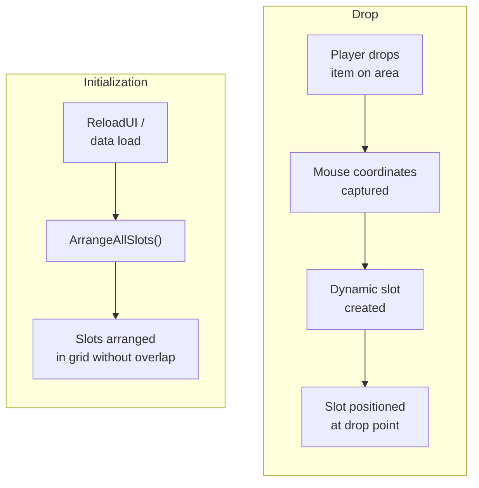
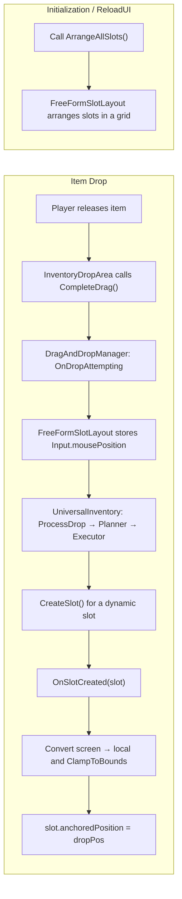

# Example: Free-Form Layout

`FreeFormSlotLayout` es un componente de ejemplo que demuestra cómo construir un inventario con layout libre encima del core drag-and-drop pipeline. Los items aparecen donde el jugador los suelta, los slots se crean dinámicamente y los drops superpuestos se desplazan a la posición libre más cercana.

---

## Cómo funciona



Idea clave: las coordenadas **no pasan** a través del transfer pipeline (policy / planner / executor). El posicionamiento es un problema puramente de UI, resuelto mediante dos hooks:

1. `DragAndDropManager.OnDropAttempting` — capturar la posición del ratón.
2. `UniversalInventory.OnSlotCreated` — colocar el nuevo slot en las coordenadas capturadas.

---

## Componentes

| Componente | Propósito |
|-----------|---------|
| **FreeFormSlotLayout** | Componente de ejemplo: posiciona slots creados dinámicamente en el punto de drop durante el drag, resuelve solapamientos y los ordena en una cuadrícula durante la inicialización |
| **InventoryDropArea** | Drop area estándar: no necesita modificaciones |
| **UniversalInventory** | Inventario con slots `Dynamic`. Proporciona el evento `OnSlotCreated` y acceso a `SlotContainer` |

---

## Configuración

### 1. Configura el inventario

En `UniversalInventory`, establece:

- **Slot Management** = `Dynamic`
- **Max Free Slots** = `0` (los slots se crean solo al hacer drop, no por adelantado)
- **Max Dynamic Slots** — número máximo de items

### 2. Elimina LayoutGroup

El contenedor de slots (`_slotContainer`) **no debe tener** componentes `LayoutGroup` (`HorizontalLayoutGroup`, `VerticalLayoutGroup`, `GridLayoutGroup`). Si no, el LayoutGroup sobrescribirá la posición de los slots.

### 3. Añade FreeFormSlotLayout

Añade el componente `FreeFormSlotLayout` al mismo GameObject que `UniversalInventory`. Configura:

- **UI Camera** — cámara de UI. Déjalo vacío para Canvas en Screen Space - Overlay.
- **Slot Spacing** — separación mínima entre slots durante el auto-layout.
- **Bounds Override** — RectTransform que limita la posición de los slots. Si no se asigna, se usa el slot container.

### 4. Añade InventoryDropArea

`InventoryDropArea` estándar: no hacen falta subclases.

---

## Lifecycle



---

## Extensión: persistencia de posición

`FreeFormSlotLayout` proporciona utilidades para trabajar con coordenadas normalizadas:

```csharp
// Save: get position as 0..1
Vector2 normalized = layout.GetNormalizedPosition(slot);
myModel.SavePosition(slot.Index, normalized);

// Restore: convert normalized back to local
Vector2 local = layout.NormalizedToLocal(savedNormalized);
layout.SetSlotPosition(slot, local);
```

Las coordenadas normalizadas son independientes del tamaño del contenedor: las posiciones escalan correctamente entre distintas resoluciones.

---

## Evitar solapamientos

El ejemplo incluye ahora resolución integrada de solapamientos. Si el punto de drop ya está ocupado, `FreeFormSlotLayout` busca posiciones vecinas en anillos crecientes y elige la posición libre más cercana dentro de los límites.

---

## Construir tu propio layout

`FreeFormSlotLayout` se presenta deliberadamente como ejemplo, no como un modo de layout integrado obligatorio. Estos son los puntos de extensión a través de los cuales puede construirse cualquier lógica de layout:

### Hooks disponibles

| Hook | Cuándo se dispara | Para qué usarlo |
|------|---------------|-------------------|
| `UniversalInventory.OnSlotCreated` | Después de crear el slot (`Instantiate` + `Initialize`) | Posicionamiento, inicialización visual |
| `DragAndDropManager.OnDropAttempting` | Antes de procesar el drop | Capturar coordenadas del ratón, preparar estado |
| `DragAndDropManager.OnDropCompleted` | Después de una transferencia exitosa | Post-procesado, animaciones, actualizaciones del layout |
| `DragAndDropManager.OnDragCancelled` | Drop cancelado | Resetear estado pendiente |
| `UniversalInventory.OnItemAdded` | Item añadido a un slot | Reaccionar a cambios de contenido |

### Patrón de implementación

Cualquier layout personalizado sigue el mismo principio:

1. **Componente en el inventario** — `MonoBehaviour` con `[RequireComponent(typeof(UniversalInventory))]`.
2. **Suscribirse a `OnSlotCreated`** — posicionar el slot inmediatamente después de crearlo.
3. **Suscribirse a eventos globales** — capturar contexto (coordenadas, estado) antes del drop processing.
4. **Método `ArrangeAllSlots()`** — para el layout inicial y el recálculo después de ReloadUI.

```csharp
[RequireComponent(typeof(UniversalInventory))]
public class MyCustomLayout : MonoBehaviour
{
    private UniversalInventory _inventory;

    void Awake() => _inventory = GetComponent<UniversalInventory>();

    void OnEnable()
    {
        _inventory.OnSlotCreated += HandleSlotCreated;
        // + subscribe to DragAndDropManager events as needed
    }

    void OnDisable()
    {
        _inventory.OnSlotCreated -= HandleSlotCreated;
    }

    void HandleSlotCreated(BaseSlot slot)
    {
        // Your positioning logic
        var rt = slot.Transform as RectTransform;
        rt.anchoredPosition = CalculatePosition(slot);
    }

    public void ArrangeAllSlots()
    {
        foreach (var slot in _inventory.Slots)
        {
            var rt = slot.Transform as RectTransform;
            rt.anchoredPosition = CalculatePosition(slot);
        }
    }

    Vector2 CalculatePosition(BaseSlot slot) { /* ... */ return Vector2.zero; }
}
```

### Ideas de layout personalizado

| Layout | Idea | Lógica clave |
|--------|------|-----------|
| **Circular** | Slots sobre un círculo | `angle = slot.Index * (360f / totalSlots)` |
| **Snap Grid** | Drop libre, pero ajustado a cuadrícula | Redondear coordenadas de drop a la celda más cercana |
| **Physics** | Los slots "caen" con físicas | Añadir `Rigidbody2D` a los slots, desactivar kinematic |
| **Radial Menu** | Slots desplegados desde el centro | Posición = dirección desde el centro * radio |

---

## Referencia

| Clase | Rol |
|-------|------|
| `FreeFormSlotLayout` | Componente de ejemplo para posicionamiento libre de slots con resolución de solapamientos |
| `UniversalInventory.OnSlotCreated` | Evento de creación de slots: hook principal para sistemas de layout |
| `UniversalInventory.SlotContainer` | Acceso al Transform contenedor para conversión de coordenadas |
| `InventoryDropArea` | Drop area estándar, funciona sin modificaciones |
| `DynamicSlotDecorator` | Decorador de strategy: crea slots automáticamente cuando hace falta |

