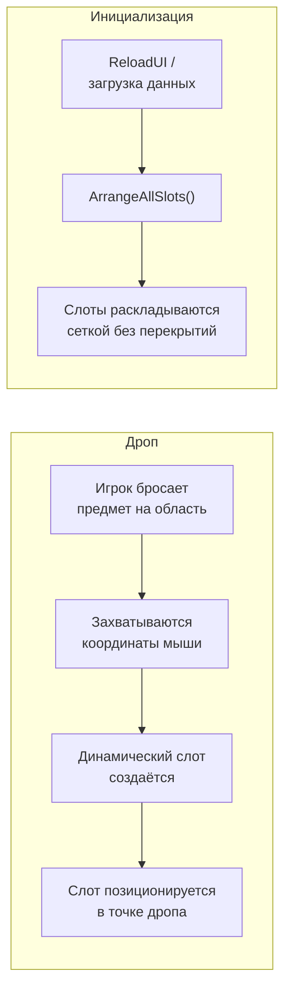
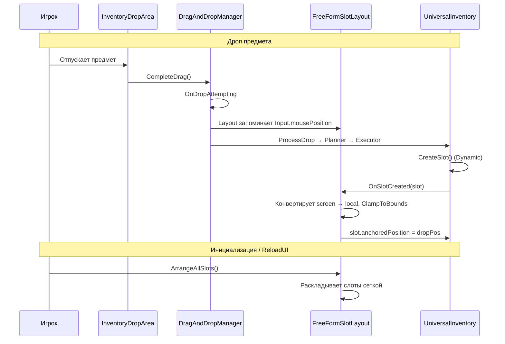

# Свободное размещение (Free-Form Layout)

Компонент `FreeFormSlotLayout` --- пример layout-системы для инвентарей, в которых слоты не привязаны к сетке. Предмет появляется в том месте, куда игрок его бросил. Слоты создаются динамически и позиционируются по координатам дропа.

---

## Как это работает



Ключевая идея: координаты **не прокидываются** через transfer pipeline (policy / planner / executor). Позиционирование --- чисто UI-задача, решаемая через два хука:

1. `DragAndDropManager.OnDropAttempting` --- запоминаем позицию мыши.
2. `UniversalInventory.OnSlotCreated` --- ставим новый слот в запомненную позицию.

---

## Компоненты

| Компонент | Назначение |
|-----------|------------|
| **FreeFormSlotLayout** | Позиционирует динамически создаваемые слоты: в точке дропа при перетаскивании, сеткой при инициализации |
| **InventoryDropArea** | Стандартная область дропа --- изменений не требует |
| **UniversalInventory** | Инвентарь с `Dynamic` слотами. Предоставляет событие `OnSlotCreated` и доступ к `SlotContainer` |

---

## Настройка

### 1. Настройте инвентарь

На `UniversalInventory` установите:

- **Slot Management** = `Dynamic`
- **Max Free Slots** = `0` (слоты создаются только при дропе, не заранее)
- **Max Dynamic Slots** --- максимальное количество предметов

### 2. Уберите LayoutGroup

На контейнере слотов (`_slotContainer`) **не должно быть** компонентов `LayoutGroup` (`HorizontalLayoutGroup`, `VerticalLayoutGroup`, `GridLayoutGroup`). Иначе LayoutGroup будет перезаписывать позиции.

### 3. Добавьте FreeFormSlotLayout

Добавьте компонент `FreeFormSlotLayout` на тот же GameObject, что и `UniversalInventory`. Настройте:

- **UI Camera** --- камера для UI. Оставить пустым для Screen Space - Overlay Canvas.
- **Slot Spacing** --- минимальный отступ между слотами при авто-раскладке.
- **Bounds Override** --- RectTransform, ограничивающий позиции. Если не задан --- используется контейнер слотов.

### 4. Добавьте InventoryDropArea

Стандартный `InventoryDropArea` --- никаких подклассов не нужно.

---

## Жизненный цикл



---

## Расширение: сохранение позиций (Persistence)

`FreeFormSlotLayout` предоставляет утилиты для работы с нормализованными координатами:

```csharp
// Сохранение: получить позицию 0..1
Vector2 normalized = layout.GetNormalizedPosition(slot);
myModel.SavePosition(slot.Index, normalized);

// Восстановление: из нормализованных обратно в локальные
Vector2 local = layout.NormalizedToLocal(savedNormalized);
layout.SetSlotPosition(slot, local);
```

Нормализованные координаты не зависят от размера контейнера --- позиции корректно масштабируются при изменении разрешения.

---

## Расширение: предотвращение наложений (Overlap Avoidance)

В текущей реализации слоты могут перекрываться при дропе в одну точку. Для решения можно расширить `FreeFormSlotLayout`, добавив проверку `Rect.Overlaps` после позиционирования и сдвиг к ближайшей свободной позиции.

---

## Создание своего Layout

`FreeFormSlotLayout` --- пример, а не единственный вариант. Вот точки расширения, через которые можно построить любую layout-логику:

### Доступные хуки

| Хук | Когда срабатывает | Для чего использовать |
|-----|-------------------|----------------------|
| `UniversalInventory.OnSlotCreated` | После создания слота (`Instantiate` + `Initialize`) | Позиционирование, инициализация визуалов |
| `DragAndDropManager.OnDropAttempting` | Перед обработкой дропа | Захват координат мыши, подготовка состояния |
| `DragAndDropManager.OnDropCompleted` | После успешного переноса | Пост-обработка, анимации, обновление layout |
| `DragAndDropManager.OnDragCancelled` | Дроп отменён | Сброс pending-состояния |
| `UniversalInventory.OnItemAdded` | Предмет добавлен в слот | Реакция на изменение содержимого |

### Паттерн реализации

Любой кастомный layout строится по одному принципу:

1. **Компонент на инвентаре** --- `MonoBehaviour` с `[RequireComponent(typeof(UniversalInventory))]`.
2. **Подписка на `OnSlotCreated`** --- позиционировать слот сразу после создания.
3. **Подписка на глобальные события** --- захватывать контекст (координаты, состояние) перед обработкой дропа.
4. **Метод `ArrangeAllSlots()`** --- для начальной раскладки и пересчёта после ReloadUI.

```csharp
[RequireComponent(typeof(UniversalInventory))]
public class MyCustomLayout : MonoBehaviour
{
    private UniversalInventory _inventory;

    void Awake() => _inventory = GetComponent<UniversalInventory>();

    void OnEnable()
    {
        _inventory.OnSlotCreated += HandleSlotCreated;
        // + подписки на события DragAndDropManager при необходимости
    }

    void OnDisable()
    {
        _inventory.OnSlotCreated -= HandleSlotCreated;
    }

    void HandleSlotCreated(ISlot slot)
    {
        // Ваша логика позиционирования
        var rt = slot.Transform as RectTransform;
        rt.anchoredPosition = CalculatePosition(slot);
    }

    public void ArrangeAllSlots()
    {
        foreach (var slot in _inventory.Slots)
        {
            var rt = slot.Transform as RectTransform;
            rt.anchoredPosition = CalculatePosition(slot);
        }
    }

    Vector2 CalculatePosition(ISlot slot) { /* ... */ return Vector2.zero; }
}
```

### Примеры кастомных layout-ов

| Layout | Идея | Ключевая логика |
|--------|------|-----------------|
| **Circular** | Слоты по окружности | `angle = slot.Index * (360f / totalSlots)` |
| **Snap Grid** | Свободный дроп, но привязка к сетке | Округлить координаты дропа до ближайшей ячейки |
| **Physics** | Слоты «падают» с физикой | Добавить Rigidbody2D на слоты, отключить кинематику |
| **Radial Menu** | Слоты веером от центра | Позиция = направление от центра * радиус |

---

## Справочник

| Класс | Роль |
|-------|------|
| `FreeFormSlotLayout` | Позиционирует слоты в точке дропа или сеткой при инициализации |
| `UniversalInventory.OnSlotCreated` | Событие создания слота --- основной хук для layout-систем |
| `UniversalInventory.SlotContainer` | Доступ к Transform-контейнеру для конвертации координат |
| `InventoryDropArea` | Стандартная область дропа, работает без изменений |
| `DynamicSlotDecorator` | Декоратор стратегии: автоматически создаёт слоты при нехватке |
