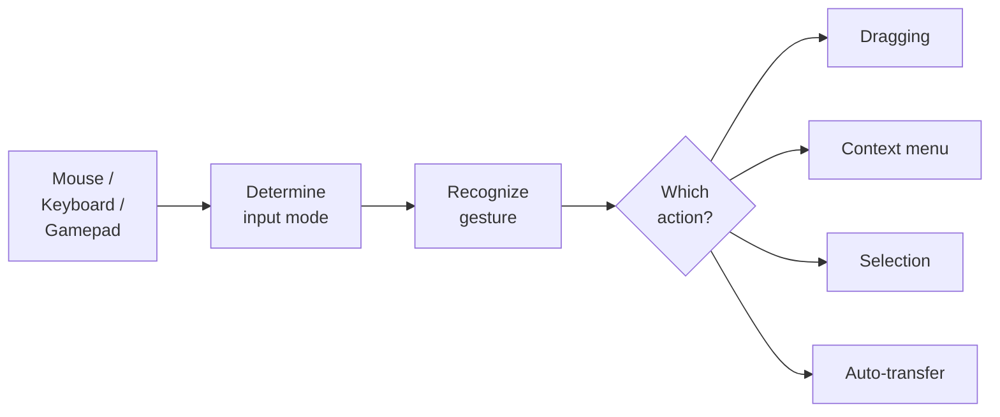
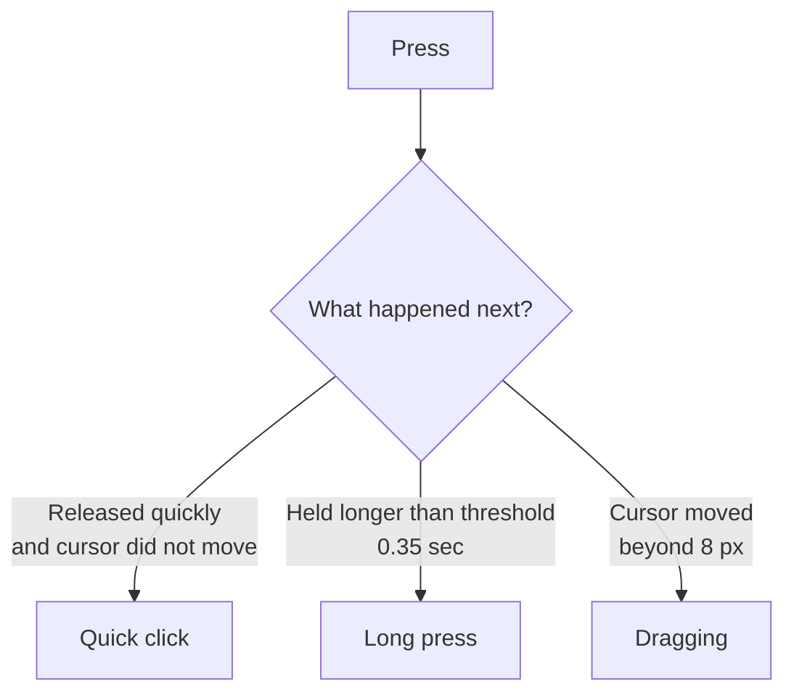

# Input and Interaction

The input system separates input detection (mouse, keyboard, gamepad, or legacy navigation axes) from actions (dragging, selection, context menu). This allows changing bindings without rewriting logic and supporting different input devices.

---

## How Input Works

The slot itself does not know what to do with input. It forwards raw events (press, release, hover) to `InputEventRouter`, which finds the appropriate binding and executes the action.

---

## Press Phases

The system distinguishes several press types by duration and cursor movement:

| Phase | Condition | Typical Action |
|-------|-----------|----------------|
| **ClickShort** | Pressed and released quickly, cursor did not move | Auto-transfer, selection |
| **ClickLong** | Held longer than threshold, cursor did not move | Context menu |
| **Down** | Moment of press | Start dragging |
| **Up** | Moment of release | Finish dragging |

Thresholds are configured in `InputEventRouter`: `_longClickThresholdSeconds` (default 0.35 sec) and `_clickMoveTolerancePixels` (default 8 pixels).

---

## Binding Profiles

Bindings are configured via the ScriptableObject `InteractionBindingsProfile`. It contains pointer bindings, legacy `KeyCode` bindings, legacy Input Manager button-name bindings, and optional Input Action bindings.

### Pointer Bindings

Each binding consists of: mouse button + modifier + phase + action.

| Button | Modifier | Phase | Action |
|--------|----------|-------|--------|
| LMB | --- | ClickShort | Auto-transfer |
| LMB | --- | Down | Start dragging |
| LMB | --- | Up | Finish dragging |
| LMB | Ctrl | ClickShort | Toggle selection |
| LMB | Shift | ClickShort | Range selection |
| RMB | --- | ClickShort | Context menu |

### Legacy Input Manager Bindings

Use `LegacyInputActionBinding` when a project still relies on the old Input Manager and you want to bind by button name instead of `KeyCode`.
Typical names are `Submit`, `Cancel`, or any custom button configured in **Project Settings > Input Manager**.

| Button Name | Phase | Typical Action |
|-------------|-------|----------------|
| Submit | Down | Auto-transfer or complete drag |
| Cancel | Down | Cancel drag or close UI |

These bindings are polled by `InputEventRouter` and require Legacy Input Manager support to be enabled in Player Settings.
They are separate from `InputActionBinding`, which belongs to the new Input System package.

### Input Action Bindings

For optional hotkeys and gamepad-specific setups: bind an Input System Action to an inventory action.
Mixed setups are supported, but keep in mind that `InputAction`-driven features still expect the new input pipeline to be configured for that scene/workflow.
If a scene intentionally stays on `StandaloneInputModule`, pointer and navigation can still work there while some `InputAction` features do not.

---

## Input Mode

The system automatically determines the current input mode:

| Mode | How It Activates | Behavior |
|------|-----------------|----------|
| **Mouse** | Mouse click or mouse movement | Focus via hover, standard pointer events |
| **Navigation** | Arrows, WASD, Submit/Cancel, Tab, gamepad D-pad | Focus via `EventSystem.selectedGameObject`, navigation between slots |

Switching happens automatically in both legacy input and the new Input System. When Navigation mode is active, `InputEventRouter` maintains focus on a slot --- if the currently selected object becomes inactive, the system finds the nearest available slot.

---

## Overriding Bindings Per Inventory

Each inventory can have its own bindings via the `InventoryExtraInteractionBinder` component. This is useful when a merchant and a player have different click behavior.

If an inventory does not have an `InventoryExtraInteractionBinder`, the default `InteractionBindingsProfile` from `InputEventRouter` is used.

---

## Split Drop

While dragging a stack, you can drop a portion of the items into a slot without ending the drag. The remaining items stay "in hand" and the visual counter updates automatically.

This uses the built-in `SplitDropAction`:

| Parameter | Description | Default |
|-----------|-------------|:-------:|
| `_splitCount` | How many items to split off per action | 1 |
| `_dropPolicyOverride` | Drop policy override for this operation | --- |

### Binding Setup

Add a `PointerBinding` to `InteractionBindingsProfile`:

| Button | Modifier | Phase | Action |
|--------|----------|-------|--------|
| LMB | Shift | Down | `SplitDropAction` |

!!! tip "Binding Order"
    The `Shift + LMB` binding must be placed **above** the default LMB binding (Start/Complete drag) so the modifier matches first.

### How It Works

1. Player picks up a stack of 10 items (normal drag).
2. Holds Shift and clicks an empty slot.
3. 1 item is transferred through the standard pipeline (transfer engine → events).
4. Dragging continues with 9 items, visual updates.
5. When only 1 item remains, Shift+Click performs a regular `CompleteDrag`.

If the target slot is occupied and cannot accept the item, the operation rolls back — the stack remains unchanged.

---

## Class Reference

| Class | Role |
|-------|------|
| `InputEventRouter` | Singleton: routes input to bindings |
| `InteractionBindingsProfile` | SO profile with pointer, legacy, and Input Action bindings |
| `SlotInputAdapter` | Component on a slot: forwards raw events |
| `InputModalityTracker` | Determines the current input mode (Mouse / Navigation) for both legacy and Input System setups |
| `PointerBinding` | Binding: button + modifier + phase + action |
| `KeyBinding` | Legacy `KeyCode` binding to an action |
| `LegacyInputActionBinding` | Old Input Manager button-name binding to an action |
| `InputActionBinding` | Input System Action binding to an action |
| `InventoryExtraInteractionBinder` | Binding override for a specific inventory |
| `SplitDropAction` | Action: drop part of a stack without ending drag |
| `SlotInteractionAction` | Base class for actions (inherit for custom ones) |
