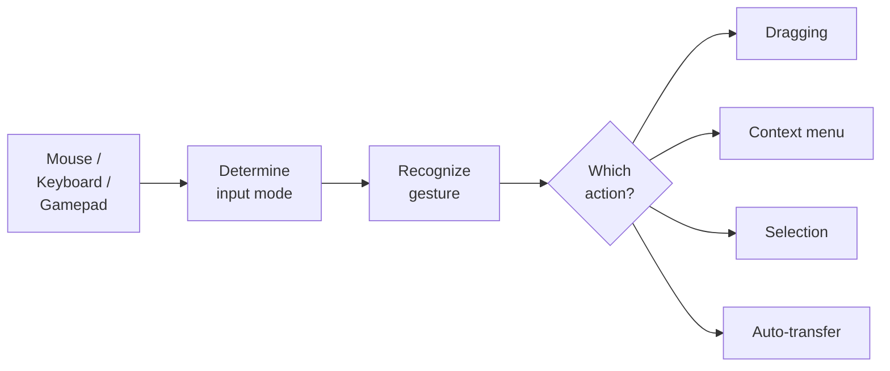
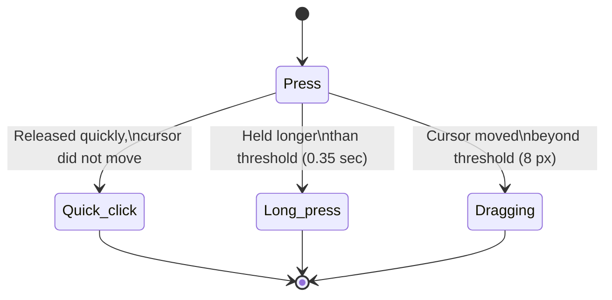

# Input and Interaction

The input system separates input detection (mouse, keyboard, gamepad) from actions (dragging, selection, context menu). This allows changing bindings without rewriting logic and supporting different input devices.

---

## How Input Works

The slot itself does not know what to do with input. It forwards raw events (press, release, hover) to `InputEventRouter`, which finds the appropriate binding and executes the action.

---

## Press Phases

The system distinguishes several press types by duration and cursor movement:

| Phase | Condition | Typical Action |
|-------|-----------|----------------|
| **ClickShort** | Pressed and released quickly, cursor did not move | Auto-transfer, selection |
| **ClickLong** | Held longer than threshold, cursor did not move | Context menu |
| **Down** | Moment of press | Start dragging |
| **Up** | Moment of release | Finish dragging |

Thresholds are configured in `InputEventRouter`: `_longClickThresholdSeconds` (default 0.35 sec) and `_clickMoveTolerancePixels` (default 8 pixels).

---

## Binding Profiles

Bindings are configured via the ScriptableObject `InteractionBindingsProfile`. It contains two lists:

### Pointer Bindings

Each binding consists of: mouse button + modifier + phase + action.

| Button | Modifier | Phase | Action |
|--------|----------|-------|--------|
| LMB | --- | ClickShort | Auto-transfer |
| LMB | --- | Down | Start dragging |
| LMB | --- | Up | Finish dragging |
| LMB | Ctrl | ClickShort | Toggle selection |
| LMB | Shift | ClickShort | Range selection |
| RMB | --- | ClickShort | Context menu |

### Input Action Bindings

For hotkeys and gamepad: binding an Input System Action to an inventory action.

---

## Input Mode

The system automatically determines the current input mode:

| Mode | How It Activates | Behavior |
|------|-----------------|----------|
| **Mouse** | Any mouse click | Focus via hover, standard pointer events |
| **Navigation** | Arrows, WASD, gamepad D-pad | Focus via EventSystem.selectedGameObject, navigation between slots |

Switching happens automatically. When Navigation mode is active, `InputEventRouter` maintains focus on a slot --- if the currently selected object becomes inactive, the system finds the nearest available slot.

---

## Overriding Bindings Per Inventory

Each inventory can have its own bindings via the `InventoryExtraInteractionBinder` component. This is useful when a merchant and a player have different click behavior.

If an inventory does not have an `InventoryExtraInteractionBinder`, the default `InteractionBindingsProfile` from `InputEventRouter` is used.

---

## Class Reference

| Class | Role |
|-------|------|
| `InputEventRouter` | Singleton: routes input to bindings |
| `InteractionBindingsProfile` | SO profile with pointer and Input Action bindings |
| `SlotInputAdapter` | Component on a slot: forwards raw events |
| `InputModalityTracker` | Determines the current input mode (Mouse / Navigation) |
| `PointerBinding` | Binding: button + modifier + phase + action |
| `InputActionBinding` | Input System Action binding to an action |
| `InventoryExtraInteractionBinder` | Binding override for a specific inventory |
| `SlotInteractionAction` | Base class for actions (inherit for custom ones) |
