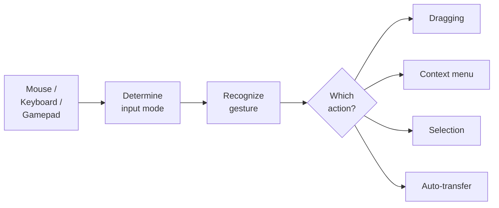
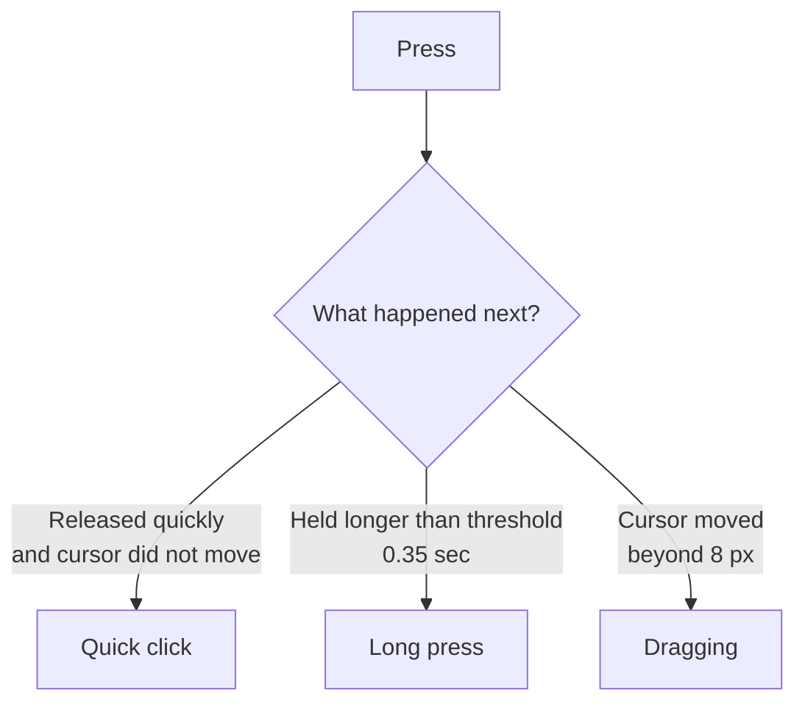

# Input and Interaction

El sistema de input separa la detección de entrada (mouse, teclado, gamepad) de las acciones (dragging, selection, context menu). Esto permite cambiar bindings sin reescribir lógica y soportar distintos dispositivos de entrada.

---

## Cómo funciona el input

El slot en sí no sabe qué hacer con el input. Reenvía los raw events (press, release, hover) a `InputEventRouter`, que encuentra el binding apropiado y ejecuta la acción.

---

## Fases de pulsación

El sistema distingue varios tipos de pulsación según duración y movimiento del cursor:

| Fase | Condición | Acción típica |
|-------|-----------|----------------|
| **ClickShort** | Se pulsa y se suelta rápido, el cursor no se mueve | Auto-transfer, selection |
| **ClickLong** | Se mantiene pulsado más tiempo del umbral, el cursor no se mueve | Context menu |
| **Down** | Momento de la pulsación | Empezar drag |
| **Up** | Momento de soltar | Terminar drag |

Los umbrales se configuran en `InputEventRouter`: `_longClickThresholdSeconds` (por defecto 0.35 s) y `_clickMoveTolerancePixels` (por defecto 8 píxeles).

---

## Binding Profiles

Los bindings se configuran mediante el ScriptableObject `InteractionBindingsProfile`. Contiene dos listas:

### Pointer Bindings

Cada binding consiste en: botón de ratón + modificador + fase + acción.

| Botón | Modificador | Fase | Acción |
|--------|----------|-------|--------|
| LMB | --- | ClickShort | Auto-transfer |
| LMB | --- | Down | Start dragging |
| LMB | --- | Up | Finish dragging |
| LMB | Ctrl | ClickShort | Toggle selection |
| LMB | Shift | ClickShort | Range selection |
| RMB | --- | ClickShort | Context menu |

### Input Action Bindings

Para atajos y gamepad: vincular una Input System Action con una acción de inventario.

---

## Modo de input

El sistema determina automáticamente el modo de input actual:

| Modo | Cómo se activa | Comportamiento |
|------|-----------------|----------|
| **Mouse** | Cualquier clic de ratón | Focus por hover, pointer events estándar |
| **Navigation** | Flechas, WASD, gamepad D-pad | Focus vía `EventSystem.selectedGameObject`, navegación entre slots |

El cambio ocurre automáticamente. Cuando el modo Navigation está activo, `InputEventRouter` mantiene el focus sobre un slot: si el objeto seleccionado deja de estar activo, el sistema busca el slot disponible más cercano.

---

## Sobrescribir bindings por inventario

Cada inventario puede tener sus propios bindings mediante el componente `InventoryExtraInteractionBinder`. Esto es útil cuando un comerciante y un jugador tienen comportamientos de clic distintos.

Si un inventario no tiene `InventoryExtraInteractionBinder`, se usa el `InteractionBindingsProfile` por defecto de `InputEventRouter`.

---

## Referencia de clases

| Clase | Rol |
|-------|------|
| `InputEventRouter` | Singleton: enruta el input hacia los bindings |
| `InteractionBindingsProfile` | SO profile con pointer bindings y Input Action bindings |
| `SlotInputAdapter` | Componente en un slot: reenvía raw events |
| `InputModalityTracker` | Determina el modo de input actual (Mouse / Navigation) |
| `PointerBinding` | Binding: botón + modificador + fase + acción |
| `InputActionBinding` | Binding de Input System Action a una acción |
| `InventoryExtraInteractionBinder` | Override de bindings para un inventario concreto |
| `SlotInteractionAction` | Clase base de las acciones (hereda de ella para crear las tuyas) |

