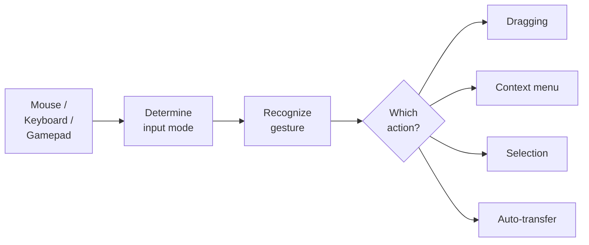
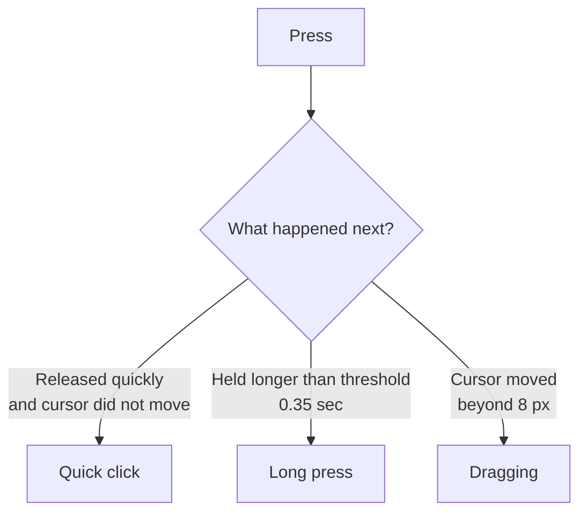

# Input and Interaction

El sistema de input separa la detección de entrada (mouse, teclado, gamepad y ejes de navegación legacy) de las acciones (dragging, selection, context menu). Esto permite cambiar bindings sin reescribir lógica y soportar distintos dispositivos de entrada.

---

## Cómo funciona el input

El slot en sí no sabe qué hacer con el input. Reenvía los raw events (press, release, hover) a `InputEventRouter`, que encuentra el binding apropiado y ejecuta la acción.

---

## Fases de pulsación

El sistema distingue varios tipos de pulsación según duración y movimiento del cursor:

| Fase | Condición | Acción típica |
|-------|-----------|----------------|
| **ClickShort** | Se pulsa y se suelta rápido, el cursor no se mueve | Auto-transfer, selection |
| **ClickLong** | Se mantiene pulsado más tiempo del umbral, el cursor no se mueve | Context menu |
| **Down** | Momento de la pulsación | Empezar drag |
| **Up** | Momento de soltar | Terminar drag |

Los umbrales se configuran en `InputEventRouter`: `_longClickThresholdSeconds` (por defecto 0.35 s) y `_clickMoveTolerancePixels` (por defecto 8 píxeles).

---

## Binding Profiles

Los bindings se configuran mediante el ScriptableObject `InteractionBindingsProfile`. Contiene pointer bindings, bindings legacy `KeyCode`, bindings del Input Manager legacy por nombre de botón y bindings Input Action opcionales.

### Pointer Bindings

Cada binding consiste en: botón de ratón + modificador + fase + acción.

| Botón | Modificador | Fase | Acción |
|--------|----------|-------|--------|
| LMB | --- | ClickShort | Auto-transfer |
| LMB | --- | Down | Start dragging |
| LMB | --- | Up | Finish dragging |
| LMB | Ctrl | ClickShort | Toggle selection |
| LMB | Shift | ClickShort | Range selection |
| RMB | --- | ClickShort | Context menu |

### Bindings del Input Manager legacy

Usa `LegacyInputActionBinding` cuando el proyecto todavía dependa del Input Manager antiguo y quieras vincular por nombre de botón en vez de `KeyCode`.
Nombres típicos: `Submit`, `Cancel` o cualquier botón personalizado configurado en **Project Settings > Input Manager**.

| Nombre del botón | Fase | Acción típica |
|-------------------|------|---------------|
| Submit | Down | Auto-transfer o terminar drag |
| Cancel | Down | Cancelar drag o cerrar UI |

Estos bindings son consultados por `InputEventRouter` y requieren que el soporte Legacy Input Manager esté habilitado en Player Settings.
Son independientes de `InputActionBinding`, que pertenece al nuevo paquete Input System.

### Input Action Bindings

Para atajos opcionales y configuraciones específicas de gamepad: vincular una Input System Action con una acción de inventario.
Los mixed setups están soportados, pero recuerda que las funciones basadas en `InputAction` siguen esperando que esa escena o workflow estén configurados para el nuevo input pipeline.
Si una escena permanece intencionadamente en `StandaloneInputModule`, pointer y navigation pueden seguir funcionando allí mientras algunas funciones de `InputAction` no lo hacen.

---

## Modo de input

El sistema determina automáticamente el modo de input actual:

| Modo | Cómo se activa | Comportamiento |
|------|-----------------|----------|
| **Mouse** | Clic del ratón o movimiento del ratón | Focus por hover, pointer events estándar |
| **Navigation** | Flechas, WASD, Submit/Cancel, Tab, gamepad D-pad | Focus vía `EventSystem.selectedGameObject`, navegación entre slots |

El cambio ocurre automáticamente tanto con input legacy como con el nuevo Input System. Cuando el modo Navigation está activo, `InputEventRouter` mantiene el focus sobre un slot: si el objeto seleccionado deja de estar activo, el sistema busca el slot disponible más cercano.

---

## Sobrescribir bindings por inventario

Cada inventario puede tener sus propios bindings mediante el componente `InventoryExtraInteractionBinder`. Esto es útil cuando un comerciante y un jugador tienen comportamientos de clic distintos.

Si un inventario no tiene `InventoryExtraInteractionBinder`, se usa el `InteractionBindingsProfile` por defecto de `InputEventRouter`.

---

## Split Drop

Al arrastrar un stack, puedes soltar una parte de los items en un slot sin terminar el drag. Los items restantes permanecen "en mano" y el contador visual se actualiza automáticamente.

Para esto se usa la acción integrada `SplitDropAction`:

| Parámetro | Descripción | Por defecto |
|-----------|-------------|:-----------:|
| `_splitCount` | Cuántos items separar por acción | 1 |
| `_dropPolicyOverride` | Override de drop policy para esta operación | --- |

### Configuración del binding

Agrega un `PointerBinding` a `InteractionBindingsProfile`:

| Botón | Modificador | Fase | Acción |
|-------|-------------|------|--------|
| LMB | Shift | Down | `SplitDropAction` |

!!! tip "Orden de bindings"
    El binding `Shift + LMB` debe estar **encima** del binding LMB por defecto (Start/Complete drag) para que el modificador se evalúe primero.

### Cómo funciona

1. El jugador toma un stack de 10 items (drag normal).
2. Mantiene Shift y hace clic en un slot vacío.
3. 1 item se transfiere a través del pipeline estándar (planner → executor → eventos).
4. El drag continúa con 9 items, el visual se actualiza.
5. Cuando queda 1 solo item, Shift+Click ejecuta un `CompleteDrag` normal.

Si el slot destino está ocupado y no puede aceptar el item, la operación se revierte — el stack permanece sin cambios.

---

## Referencia de clases

| Clase | Rol |
|-------|------|
| `InputEventRouter` | Singleton: enruta el input hacia los bindings |
| `InteractionBindingsProfile` | SO profile con pointer, legacy e Input Action bindings |
| `SlotInputAdapter` | Componente en un slot: reenvía raw events |
| `InputModalityTracker` | Determina el modo de input actual (Mouse / Navigation) tanto en legacy como en Input System |
| `PointerBinding` | Binding: botón + modificador + fase + acción |
| `KeyBinding` | Binding legacy `KeyCode` hacia una acción |
| `LegacyInputActionBinding` | Binding del Input Manager antiguo por nombre de botón hacia una acción |
| `InputActionBinding` | Binding de Input System Action a una acción |
| `InventoryExtraInteractionBinder` | Override de bindings para un inventario concreto |
| `SplitDropAction` | Acción: soltar parte del stack sin terminar el drag |
| `SlotInteractionAction` | Clase base de las acciones (hereda de ella para crear las tuyas) |

