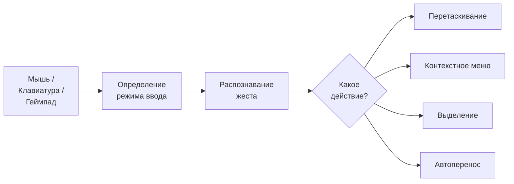
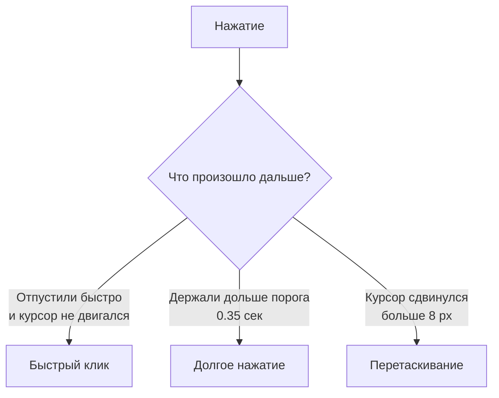

# Ввод и взаимодействие

Система ввода разделяет обнаружение ввода (мышь, клавиатура, геймпад) и действия (перетаскивание, выделение, контекстное меню). Это позволяет менять привязки без переписывания логики и поддерживать разные устройства ввода.

---

## Как устроен ввод

Слот сам не знает, что делать с вводом. Он пересылает сырые события (нажатие, отпускание, наведение) в `InputEventRouter`, который ищет подходящую привязку и выполняет действие.

---

## Фазы нажатия

Система различает несколько типов нажатия по длительности и перемещению курсора:

| Фаза | Условие | Типичное действие |
|------|---------|-------------------|
| **ClickShort** | Быстро нажали и отпустили, курсор не сдвинулся | Автоперенос, выделение |
| **ClickLong** | Держали дольше порога, курсор не сдвинулся | Контекстное меню |
| **Down** | Момент нажатия | Начало перетаскивания |
| **Up** | Момент отпускания | Завершение перетаскивания |

Пороги настраиваются в `InputEventRouter`: `_longClickThresholdSeconds` (по умолчанию 0.35 сек) и `_clickMoveTolerancePixels` (по умолчанию 8 пикселей).

---

## Профили привязок

Привязки настраиваются через ScriptableObject `InteractionBindingsProfile`. В нём два списка:

### Привязки указателя (Pointer Bindings)

Каждая привязка состоит из: кнопка мыши + модификатор + фаза + действие.

| Кнопка | Модификатор | Фаза | Действие |
|--------|-------------|------|----------|
| ЛКМ | --- | ClickShort | Автоперенос |
| ЛКМ | --- | Down | Начать перетаскивание |
| ЛКМ | --- | Up | Завершить перетаскивание |
| ЛКМ | Ctrl | ClickShort | Переключить выделение |
| ЛКМ | Shift | ClickShort | Диапазонное выделение |
| ПКМ | --- | ClickShort | Контекстное меню |

### Привязки Input Action

Для горячих клавиш и геймпада: привязка Input System Action к действию инвентаря.

---

## Режим ввода

Система автоматически определяет текущий режим ввода:

| Режим | Как активируется | Поведение |
|-------|-----------------|-----------|
| **Mouse** | Любой клик мышью | Фокус через наведение, стандартные события указателя |
| **Navigation** | Стрелки, WASD, D-pad геймпада | Фокус через EventSystem.selectedGameObject, навигация между слотами |

Переключение происходит автоматически. Когда активен режим Navigation, `InputEventRouter` поддерживает фокус на слоте --- если текущий выделенный объект стал неактивным, система находит ближайший доступный слот.

---

## Переопределение привязок для инвентаря

Каждый инвентарь может иметь свои привязки через компонент `InventoryExtraInteractionBinder`. Это полезно, когда у торговца и у игрока разное поведение по клику.

Если на инвентаре нет `InventoryExtraInteractionBinder`, используется дефолтный `InteractionBindingsProfile` из `InputEventRouter`.

---

## Частичный сброс (Split Drop)

При перетаскивании стека можно сбросить часть предметов в слот, не прекращая перетаскивание. Остаток остаётся "в руке", визуал и счётчик обновляются автоматически.

Для этого используется встроенное действие `SplitDropAction`:

| Параметр | Описание | По умолчанию |
|----------|----------|:------------:|
| `_splitCount` | Сколько предметов отщеплять за раз | 1 |
| `_dropPolicyOverride` | Переопределение drop policy для этой операции | --- |

### Настройка привязки

Добавьте `PointerBinding` в `InteractionBindingsProfile`:

| Кнопка | Модификатор | Фаза | Действие |
|--------|-------------|------|----------|
| ЛКМ | Shift | Down | `SplitDropAction` |

!!! tip "Порядок привязок"
    Привязка `Shift + ЛКМ` должна стоять **выше** обычной привязки ЛКМ (Start/Complete drag), чтобы модификатор матчился первым.

### Как работает

1. Игрок берёт стек из 10 предметов (обычный drag).
2. Зажимает Shift и кликает по пустому слоту.
3. 1 предмет переносится через стандартный конвейер (planner → executor → события).
4. Перетаскивание продолжается с 9 предметами, визуал обновляется.
5. Когда в стеке остаётся 1 предмет, Shift+Click выполняет обычный `CompleteDrag`.

Если целевой слот занят и не может принять предмет, операция откатывается — стек остаётся без изменений.

---

## Справочник классов

| Класс | Роль |
|-------|------|
| `InputEventRouter` | Синглтон: маршрутизирует ввод к привязкам |
| `InteractionBindingsProfile` | SO-профиль с привязками указателя и Input Action |
| `SlotInputAdapter` | Компонент на слоте: пересылает сырые события |
| `InputModalityTracker` | Определяет текущий режим ввода (Mouse / Navigation) |
| `PointerBinding` | Привязка: кнопка + модификатор + фаза + действие |
| `InputActionBinding` | Привязка Input System Action к действию |
| `InventoryExtraInteractionBinder` | Переопределение привязок для конкретного инвентаря |
| `SplitDropAction` | Действие: сбросить часть стека, не прекращая drag |
| `SlotInteractionAction` | Базовый класс действия (наследуйте для кастомных) |
