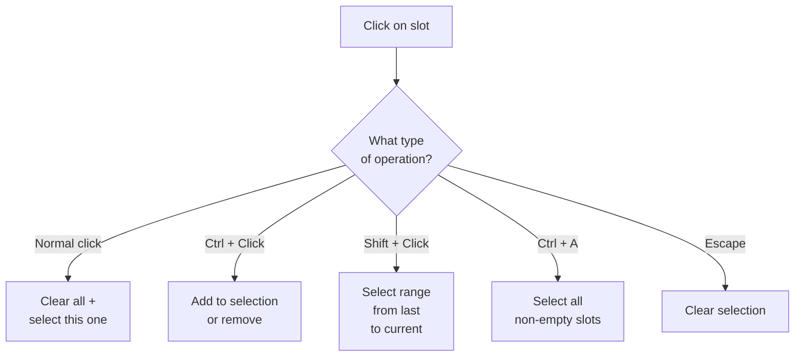
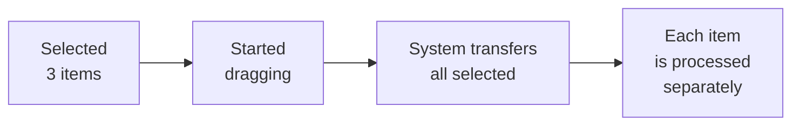

# Selection

The selection system allows selecting multiple items in an inventory and performing group operations on them --- for example, dragging all selected items at once.

---

## Selection Operations

| Action | What Happens |
|--------|--------------|
| **Click** | Clear previous selection, select one item |
| **Ctrl + Click** | Toggle: add to selection or remove from it |
| **Shift + Click** | Select range from last selected to current |
| **Ctrl + A** | Select all non-empty inventory slots |
| **Escape** | Clear all selection |

---

## How It Looks

---

## Group Dragging

Selected items can be dragged all at once. The system automatically creates a transfer for each selected slot.

If the selection is empty, only the slot that was grabbed is dragged. Transfers from different inventories can be restricted via the `_restrictToSameInventory` setting.

### How batch transfer works

During group dragging, the target slot (where items are dropped) is used only as a hint. The system finds suitable slots for each item automatically.

Batch transfer is always sequential best-effort. Each entry is checked against the
current target state; entries that fit are committed, while failed entries remain
in their source. A partial stack may transfer only the amount that fits when the
target policy allows partial transfer.

Swap is not supported during batch transfer — only placement into free or compatible slots.

After a successful batch transfer, the selection is automatically cleared.

---

## Setup

1. **Add `SelectionManager`** to the scene (singleton, one per scene).
2. **Add `SlotSelectionView`** to the slot prefab --- it highlights selected slots. Configure colors and the indicator object in the inspector.
3. **Configure triggers** --- bind selection operations to input:
    - Via pointer bindings in `InteractionBindingsProfile` (Ctrl+Click, Shift+Click --- as `SelectionSlotAction` with the appropriate operation).
    - Via `InputActionSelectionTrigger` for hotkeys (Ctrl+A, Escape).
    - Via `ButtonSelectionTrigger` for UI buttons ("Select All", "Clear Selection").

---

## Class Reference

| Class | Role |
|-------|------|
| `SelectionManager` | Singleton, stores selection state |
| `SelectionContext` | Immutable snapshot of the current selection |
| `SlotSelectionView` | Component on a slot: highlights when selected |
| `SelectionOperationBase` | Base class for operations (inherit for custom ones) |
| `ClearAndSelectOperation` | Normal click: clear all + select one |
| `ToggleFilledSlotOperation` | Ctrl+Click: toggle a non-empty slot |
| `RangeSelectOperation` | Shift+Click: range |
| `SelectAllOperation` | Ctrl+A: all non-empty slots |
| `ClearSelectionOperation` | Escape: clear selection |
| `SelectByConditionOperation` | Selection by predicate (custom filter) |
| `SelectionSlotAction` | Action for binding to PointerBinding |
| `StartMultiDragAction` | Group dragging of selected items |
| `ButtonSelectionTrigger` | Trigger via UI Button |
| `InputActionSelectionTrigger` | Trigger via Input System Action |
