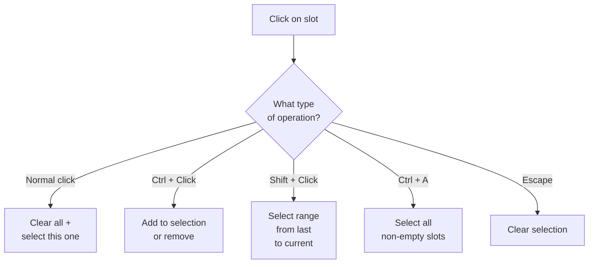
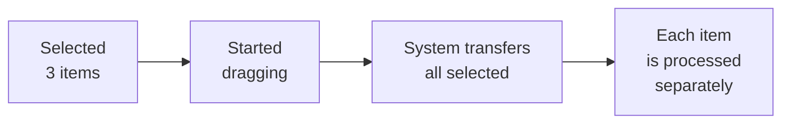

# Selection

El sistema de selección permite seleccionar varios items en un inventario y realizar operaciones de grupo sobre ellos, por ejemplo arrastrar todos los seleccionados a la vez.

---

## Operaciones de selección

| Acción | Qué ocurre |
|--------|------------|
| **Click** | Limpia la selección previa y selecciona un item |
| **Ctrl + Click** | Alterna: añade a la selección o quita de ella |
| **Shift + Click** | Selecciona un rango desde el último seleccionado hasta el actual |
| **Ctrl + A** | Selecciona todos los slots no vacíos del inventario |
| **Escape** | Limpia toda la selección |

---

## Cómo se ve

---

## Arrastre en grupo

Los items seleccionados pueden arrastrarse todos a la vez. El sistema crea automáticamente una transferencia para cada slot seleccionado.

Si la selección está vacía, solo se arrastra el slot que se cogió. Las transferencias desde distintos inventarios pueden restringirse mediante el ajuste `_restrictToSameInventory`.

### Cómo funciona la transferencia por lotes

Durante el arrastre en grupo, el slot objetivo donde se sueltan los items se usa solo como pista. El sistema encuentra automáticamente slots adecuados para cada item.

El comportamiento viene determinado por la `DropPolicy` del inventario objetivo:

| Policy | Comportamiento |
|---|---|
| **Atomic** (por defecto para batch) | Todos los items deben caber. Si uno falla, se cancela toda la operación y no se mueve nada |
| **BestEffort** | Se transfiere todo lo que quepa y el resto permanece en el origen |

El swap no está soportado durante la transferencia por lotes, solo colocación en slots libres o compatibles.

Tras una transferencia por lotes exitosa, la selección se limpia automáticamente.

---

## Configuración

1. **Añade `SelectionManager`** a la escena (singleton, uno por escena).
2. **Añade `SlotSelectionView`** al prefab del slot: resalta los slots seleccionados. Configura colores y el objeto indicador en el inspector.
3. **Configura triggers**: vincula operaciones de selección a input:
    - mediante pointer bindings en `InteractionBindingsProfile` (Ctrl+Click, Shift+Click, como `SelectionSlotAction` con la operación adecuada).
    - mediante `InputActionSelectionTrigger` para atajos de teclado (Ctrl+A, Escape).
    - mediante `ButtonSelectionTrigger` para botones de UI ("Select All", "Clear Selection").

---

## Referencia de clases

| Clase | Rol |
|-------|------|
| `SelectionManager` | Singleton, guarda el estado de selección |
| `SelectionContext` | Snapshot inmutable de la selección actual |
| `SlotSelectionView` | Componente en un slot: resalta cuando está seleccionado |
| `SelectionOperationBase` | Clase base para operaciones (hereda para crear las tuyas) |
| `ClearAndSelectOperation` | Click normal: limpiar todo + seleccionar uno |
| `ToggleSlotOperation` | Ctrl+Click: alternar |
| `RangeSelectOperation` | Shift+Click: rango |
| `SelectAllOperation` | Ctrl+A: todos los slots no vacíos |
| `ClearSelectionOperation` | Escape: limpiar selección |
| `SelectByConditionOperation` | Selección por predicado (filtro personalizado) |
| `SelectionSlotAction` | Acción para vincular a PointerBinding |
| `StartMultiDragAction` | Arrastre en grupo de los seleccionados |
| `ButtonSelectionTrigger` | Trigger mediante UI Button |
| `InputActionSelectionTrigger` | Trigger mediante Input System Action |

