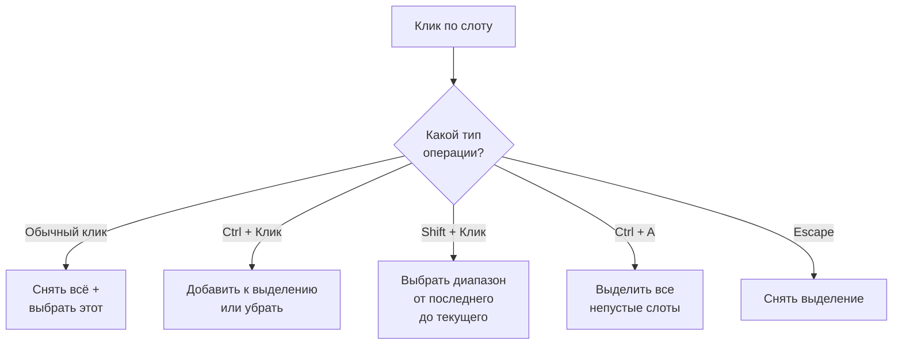
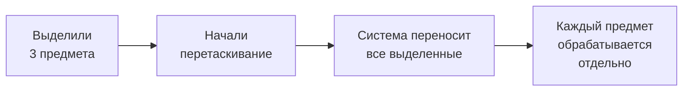

# Выделение

Система выделения позволяет выбирать несколько предметов в инвентаре и выполнять над ними групповые операции --- например, перетащить все выделенные предметы разом.

---

## Операции выделения

| Действие | Что происходит |
|----------|----------------|
| **Клик** | Снять предыдущее выделение, выбрать один предмет |
| **Ctrl + Клик** | Переключить: добавить к выделению или убрать из него |
| **Shift + Клик** | Выделить диапазон от последнего выделенного до текущего |
| **Ctrl + A** | Выделить все непустые слоты инвентаря |
| **Escape** | Снять всё выделение |

---

## Как это выглядит

---

## Групповое перетаскивание

Выделенные предметы можно перетащить все разом. Система автоматически создаёт перенос для каждого выделенного слота.

Если выделение пусто, при перетаскивании берётся только тот слот, за который потянули. Переносы из разных инвентарей можно ограничить через настройку `_restrictToSameInventory`.

---

## Настройка

1. **Добавьте `SelectionManager`** на сцену (синглтон, один на всю сцену).
2. **Добавьте `SlotSelectionView`** на префаб слота --- он подсвечивает выделенные слоты. Настройте цвета и объект-индикатор в инспекторе.
3. **Настройте триггеры** --- привяжите операции выделения к вводу:
    - Через привязки указателя в `InteractionBindingsProfile` (Ctrl+Клик, Shift+Клик --- как `SelectionSlotAction` с нужной операцией).
    - Через `InputActionSelectionTrigger` для горячих клавиш (Ctrl+A, Escape).
    - Через `ButtonSelectionTrigger` для UI-кнопок ("Выделить всё", "Снять выделение").

---

## Справочник классов

| Класс | Роль |
|-------|------|
| `SelectionManager` | Синглтон, хранит состояние выделения |
| `SelectionContext` | Неизменяемый снимок текущего выделения |
| `SlotSelectionView` | Компонент на слоте: подсвечивает при выделении |
| `SelectionOperationBase` | Базовый класс операций (наследуйте для кастомных) |
| `ClearAndSelectOperation` | Обычный клик: снять всё + выбрать один |
| `ToggleSlotOperation` | Ctrl+Клик: переключить |
| `RangeSelectOperation` | Shift+Клик: диапазон |
| `SelectAllOperation` | Ctrl+A: все непустые слоты |
| `ClearSelectionOperation` | Escape: снять выделение |
| `SelectByConditionOperation` | Выбор по предикату (кастомный фильтр) |
| `SelectionSlotAction` | Действие для привязки к PointerBinding |
| `StartMultiDragAction` | Групповое перетаскивание выделенных |
| `ButtonSelectionTrigger` | Триггер через UI Button |
| `InputActionSelectionTrigger` | Триггер через Input System Action |
