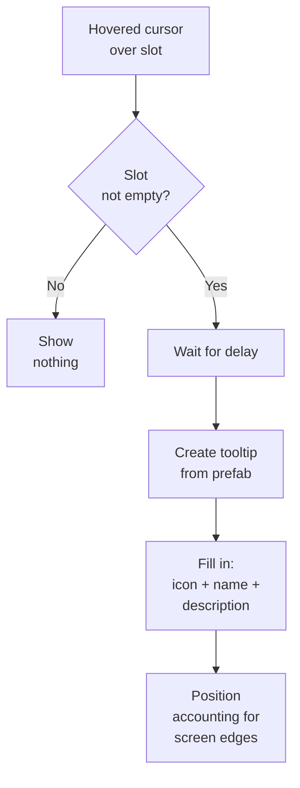

# Tooltips

Tooltips --- popup cards with item information that appear when hovering the cursor over an inventory slot. The system is optional and only works if `TooltipManager` is present in the scene.

---

## How It Works



The system automatically adapts the tooltip position: if the card does not fit on the right --- it shows on the left, if it does not fit below --- it shows above. The cursor is never overlapped by the card.

---

## Setup

1. **Add `TooltipManager`** to the scene. Assign the Canvas and tooltip prefab.
2. **Configure parameters** in the inspector:
    - `Show Delay` --- delay before appearing (default 0.5 sec).
    - `Offset` --- offset from the cursor.
    - `Anchor` --- anchor to the cursor or to a slot corner.
3. **Make sure** that the slots have a `SlotInputAdapter` component --- it generates hover events.

---

## Standard Tooltip

The built-in `DefaultTooltipView` shows:

- **Icon** of the item (`IInventoryItem.Icon`)
- **Name** (`IInventoryItem.DisplayName`)
- **Description** (if the item implements `IDescribable`)
- **Fade animation** for appearing and disappearing (configurable)

---

## Custom Tooltip

Create your own class by inheriting from `BaseTooltipView`:

```csharp
public class RPGTooltipView : BaseTooltipView
{
    [SerializeField] private TextMeshProUGUI _nameText;
    [SerializeField] private TextMeshProUGUI _statsText;
    [SerializeField] private Image _rarityBorder;

    public override void SetContent(IInventoryItem item)
    {
        _nameText.text = item.DisplayName;

        if (item is IDescribable describable)
            _statsText.text = describable.Description;

        if (item is IFilterable filterable)
            _rarityBorder.color = GetRarityColor(filterable.Rarity);
    }
}
```

Assign your prefab in `TooltipManager` instead of the default one.

---

## Positioning

| Mode | Description |
|------|-------------|
| **Cursor** | Tooltip follows the cursor (updated every frame) |
| **SlotTopRight** | Anchored to the top-right corner of the slot |
| **SlotTopLeft** | Anchored to the top-left corner of the slot |
| **SlotBottomRight** | Anchored to the bottom-right corner of the slot |
| **SlotBottomLeft** | Anchored to the bottom-left corner of the slot |

In all modes, adaptive flipping works: if the card goes beyond the screen boundaries, it automatically flips to the opposite side.

---

## Class Reference

| Class | Role |
|-------|------|
| `TooltipManager` | Manages the tooltip lifecycle |
| `BaseTooltipView` | Base class for the view (inherit for custom ones) |
| `DefaultTooltipView` | Standard implementation: icon + name + description |
| `IDescribable` | Interface for an item with a description |
