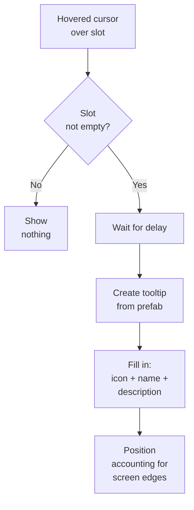

# Tooltips

Los tooltips son tarjetas emergentes con información del item que aparecen al pasar el cursor sobre un slot del inventario. El sistema es opcional y solo funciona si `TooltipManager` está presente en la escena.

---

## Cómo funciona



El sistema adapta automáticamente la posición del tooltip: si la tarjeta no cabe a la derecha, se muestra a la izquierda; si no cabe debajo, se muestra arriba. El cursor nunca queda tapado por la tarjeta.

---

## Configuración

1. **Añade `TooltipManager`** a la escena. Asígnale el Canvas y el prefab del tooltip.
2. **Configura parámetros** en el inspector:
    - `Show Delay` — retraso antes de aparecer (por defecto 0.5 s).
    - `Offset` — desplazamiento respecto al cursor.
    - `Anchor` — anclaje al cursor o a una esquina del slot.
3. **Asegúrate** de que los slots tienen un componente `SlotInputAdapter`: es quien genera los hover events.

---

## Tooltip estándar

La implementación integrada `DefaultTooltipView` muestra:

- **Icon** del item (`IItemAdapter.Icon`)
- **Name** (`IItemAdapter.DisplayName`)
- **Description** (si el item implementa `IDescribable`)
- **Fade animation** al aparecer y desaparecer (configurable)

Aquí `IDescribable` es una extensión opcional del adapter para la UI.
El inventario principal no depende de ello. Consulta [Optional Interfaces](../reference/optional-interfaces.md) para más detalles.

Por defecto, el paquete ahora usa componentes `UnityEngine.UI.Text` normales en lugar de TMP. Esto mantiene el setup principal más simple y evita una dependencia fuerte con TextMeshPro.

Si prefieres TMP, las clases de UI están diseñadas intencionadamente para poder sustituirse fácilmente: busca en el codebase `Replace to TMP Support` y reemplaza los campos `Text` correspondientes por `TMP_Text` / `TextMeshProUGUI` en tu fork específico del proyecto.

---

## Tooltip personalizado

Crea tu propia clase heredando de `BaseTooltipView`:

```csharp
using UnityEngine.UI;

public class RPGTooltipView : BaseTooltipView
{
    [SerializeField] private Text _nameText;
    [SerializeField] private Text _statsText;
    [SerializeField] private Image _rarityBorder;

    public override void SetContent(IItemAdapter item)
    {
        _nameText.text = item.DisplayName;

        if (item is IDescribable describable)
            _statsText.text = describable.Description;

        if (item is IFilterable filterable)
            _rarityBorder.color = GetRarityColor(filterable.Rarity);
    }
}
```

Si hace falta, este ejemplo puede cambiarse a TMP exactamente en los mismos lugares siguiendo los marcadores `Replace to TMP Support` de las vistas integradas.

Asigna tu prefab en `TooltipManager` en lugar del prefab por defecto.

---

## Posicionamiento

| Modo | Descripción |
|------|-------------|
| **Cursor** | El tooltip sigue al cursor (se actualiza cada frame) |
| **SlotTopRight** | Anclado a la esquina superior derecha del slot |
| **SlotTopLeft** | Anclado a la esquina superior izquierda del slot |
| **SlotBottomRight** | Anclado a la esquina inferior derecha del slot |
| **SlotBottomLeft** | Anclado a la esquina inferior izquierda del slot |

En todos los modos funciona el adaptive flipping: si la tarjeta sale de los límites de la pantalla, se invierte automáticamente hacia el lado opuesto.

---

## Referencia de clases

| Clase | Rol |
|-------|------|
| `TooltipManager` | Gestiona el lifecycle del tooltip |
| `BaseTooltipView` | Clase base de la vista (hereda de ella para crear la tuya) |
| `DefaultTooltipView` | Implementación estándar: icono + nombre + descripción |
| `IDescribable` | Ejemplo de interface opcional del adapter para descripciones de UI |

