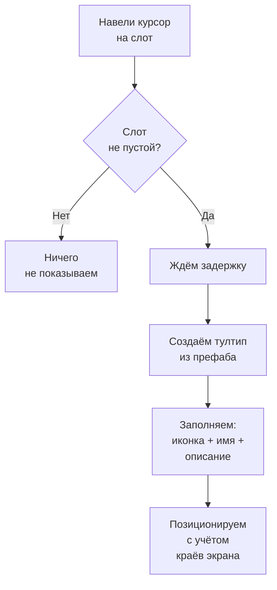

# Тултипы

Тултипы --- всплывающие карточки с информацией о предмете, которые появляются при наведении курсора на слот инвентаря. Система опциональна и работает только если на сцене есть `TooltipManager`.

---

## Как работает



Система автоматически адаптирует позицию тултипа: если карточка не влезает справа --- показывает слева, если не влезает снизу --- показывает сверху. Курсор никогда не перекрывается карточкой.

---

## Настройка

1. **Добавьте `TooltipManager`** на сцену. Назначьте Canvas и префаб тултипа.
2. **Настройте параметры** в инспекторе:
    - `Show Delay` --- задержка перед появлением (по умолчанию 0.5 сек).
    - `Offset` --- смещение от курсора.
    - `Anchor` --- привязка к курсору или к углу слота.
3. **Убедитесь**, что на слотах есть компонент `SlotInputAdapter` --- он генерирует события наведения.

---

## Стандартный тултип

Встроенный `DefaultTooltipView` показывает:

- **Иконку** предмета (`IInventoryItem.Icon`)
- **Название** (`IInventoryItem.DisplayName`)
- **Описание** (если предмет реализует `IDescribable`)
- **Fade-анимацию** появления и исчезновения (настраивается)

---

## Кастомный тултип

Создайте свой класс, унаследовавшись от `BaseTooltipView`:

```csharp
public class RPGTooltipView : BaseTooltipView
{
    [SerializeField] private TextMeshProUGUI _nameText;
    [SerializeField] private TextMeshProUGUI _statsText;
    [SerializeField] private Image _rarityBorder;

    public override void SetContent(IInventoryItem item)
    {
        _nameText.text = item.DisplayName;

        if (item is IDescribable describable)
            _statsText.text = describable.Description;

        if (item is IFilterable filterable)
            _rarityBorder.color = GetRarityColor(filterable.Rarity);
    }
}
```

Назначьте свой префаб в `TooltipManager` вместо стандартного.

---

## Позиционирование

| Режим | Описание |
|-------|----------|
| **Cursor** | Тултип следует за курсором (обновляется каждый кадр) |
| **SlotTopRight** | Привязан к правому верхнему углу слота |
| **SlotTopLeft** | Привязан к левому верхнему углу слота |
| **SlotBottomRight** | Привязан к правому нижнему углу слота |
| **SlotBottomLeft** | Привязан к левому нижнему углу слота |

Во всех режимах работает адаптивный флип: если карточка выходит за границы экрана, она автоматически переворачивается на противоположную сторону.

---

## Справочник классов

| Класс | Роль |
|-------|------|
| `TooltipManager` | Управляет жизненным циклом тултипов |
| `BaseTooltipView` | Базовый класс вьюшки (наследуйте для кастомных) |
| `DefaultTooltipView` | Стандартная реализация: иконка + имя + описание |
| `IDescribable` | Интерфейс предмета с описанием |
