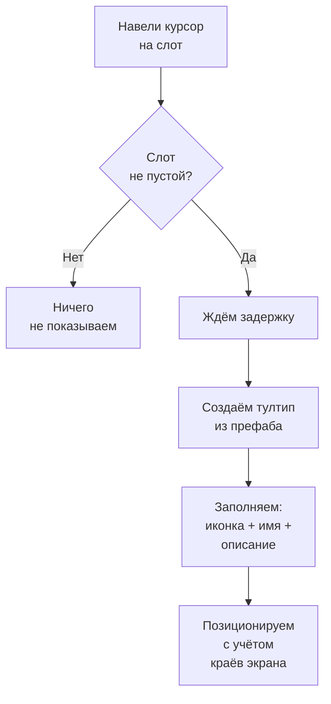

# Тултипы

Тултипы --- всплывающие карточки с информацией о предмете, которые появляются при наведении курсора на слот инвентаря. Система опциональна и работает только если на сцене есть `TooltipManager`.

---

## Как работает



Система автоматически адаптирует позицию тултипа: если карточка не влезает справа --- показывает слева, если не влезает снизу --- показывает сверху. Курсор никогда не перекрывается карточкой.

---

## Настройка

1. **Добавьте `TooltipManager`** на сцену. Назначьте Canvas и префаб тултипа.
2. **Настройте параметры** в инспекторе:
    - `Show Delay` --- задержка перед появлением (по умолчанию 0.5 сек).
    - `Offset` --- смещение от курсора.
    - `Anchor` --- привязка к курсору или к углу слота.
3. **Убедитесь**, что на слотах есть компонент `SlotInputAdapter` --- он генерирует события наведения.

---

## Стандартный тултип

Встроенный `DefaultTooltipView` показывает:

- **Иконку** предмета (`IItemAdapter.Icon`)
- **Название** (`IItemAdapter.DisplayName`)
- **Описание** (если предмет реализует `IDescribable`)
- **Fade-анимацию** появления и исчезновения (настраивается)

`IDescribable` здесь является именно optional расширением adapter'а для UI.
Core inventory не зависит от него. Подробнее — в разделе [Опциональные интерфейсы](../reference/optional-interfaces.md).

По умолчанию пакет теперь использует обычные `UnityEngine.UI.Text`, а не TMP. Это упрощает базовую установку и убирает жёсткую зависимость от TextMeshPro.

Если нужен TMP, UI-слой специально оставлен легко заменяемым: ищите по коду маркер `Replace to TMP Support` и меняйте соответствующие поля `Text` на `TMP_Text` / `TextMeshProUGUI` в своей версии проекта.

---

## Кастомный тултип

Создайте свой класс, унаследовавшись от `BaseTooltipView`:

```csharp
using UnityEngine.UI;

public class RPGTooltipView : BaseTooltipView
{
    [SerializeField] private Text _nameText;
    [SerializeField] private Text _statsText;
    [SerializeField] private Image _rarityBorder;

    public override void SetContent(IItemAdapter item)
    {
        _nameText.text = item.DisplayName;

        if (item is IDescribable describable)
            _statsText.text = describable.Description;

        if (item is IFilterable filterable)
            _rarityBorder.color = GetRarityColor(filterable.Rarity);
    }
}
```

При необходимости этот пример так же легко перевести на TMP, ориентируясь на маркеры `Replace to TMP Support` во встроенных UI-компонентах.

Назначьте свой префаб в `TooltipManager` вместо стандартного.

---

## Позиционирование

| Режим | Описание |
|-------|----------|
| **Cursor** | Тултип следует за курсором (обновляется каждый кадр), но избегает пересечения с наведенным слотом |
| **SlotPivot** | Тултип привязывается к нормализованной точке внутри наведенного слота (`Pivot`: 0,0 = левый нижний угол; 1,1 = правый верхний угол) |

Во всех режимах работает адаптивный флип: если карточка выходит за границы экрана или пересекается с наведенным слотом, менеджер выбирает более подходящую сторону.

---

## Справочник классов

| Класс | Роль |
|-------|------|
| `TooltipManager` | Управляет жизненным циклом тултипов |
| `BaseTooltipView` | Базовый класс вьюшки (наследуйте для кастомных) |
| `DefaultTooltipView` | Стандартная реализация: иконка + имя + описание |
| `IDescribable` | Пример optional-интерфейса adapter'а для UI-описания |
