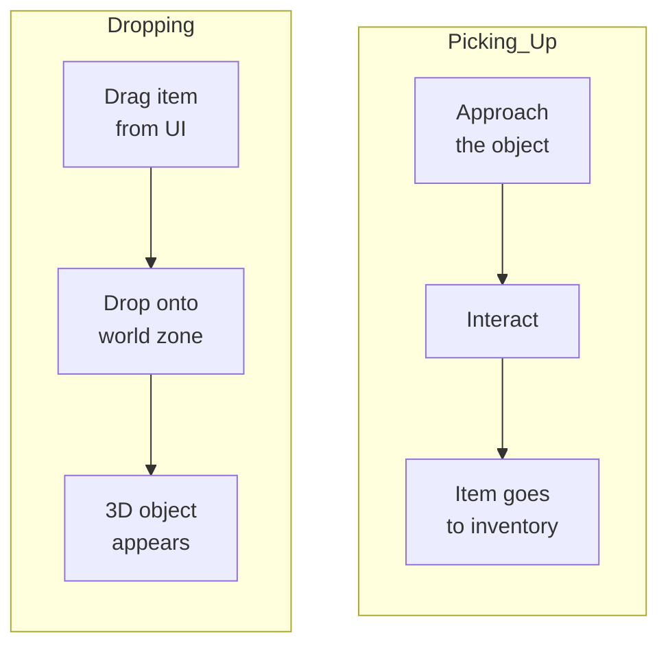
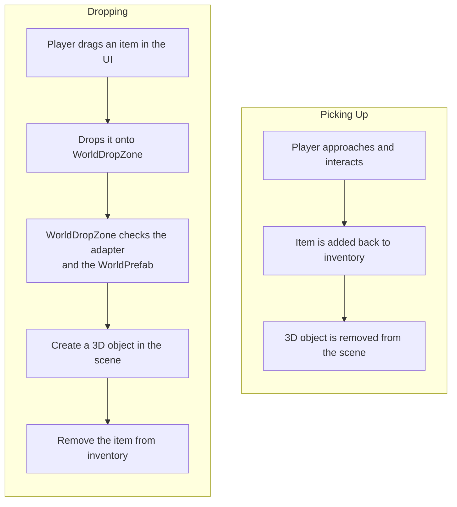

# 3D World

This integration allows dropping items from the UI inventory into a 3D scene and picking them back up. In the current package it is implemented as a `Demo2 Loot` example: `WorldDropZone` and `WorldItem` live under `Examples`, not in the core runtime.

---

## How It Works



---

## Components

| Component | Purpose |
|-----------|---------|
| **WorldDropZone** | UI area for dropping items into the world. On drop, creates a 3D object and removes the item from the inventory |
| **WorldItem** | Component on a 3D object in the world. In the demo it stores a reference to `ItemExampleWith3DSO` |
| **ItemAdapterSoWith3DAdapter** | Demo adapter that exposes a 3D prefab through its `WorldPrefab` property |

---

## Setup

### 1. Use an adapter with `WorldPrefab`

```csharp
public class ItemAdapterSoWith3DAdapter : IItemAdapter, IFilterable
{
    public readonly ItemExampleWith3DSO item;

    public string DisplayName => item.ItemName;
    public Sprite Icon => item.Icon;
    public GameObject WorldPrefab => item.WorldPrefab.gameObject;
}
```

In the current implementation, `WorldDropZone` from `Demo2 Loot` accepts `ItemAdapterSoWith3DAdapter` specifically. If your project uses a different adapter type, update `CanAcceptEntry` and the spawn logic accordingly.

### 2. Add WorldDropZone

Create a UI panel (Image with RectTransform) and add the `WorldDropZone` component. Configure:

- **Spawn Point** --- Transform point where 3D objects will appear.
- **Randomize Position** --- add random offset on spawn.
- **Random Radius** --- scatter radius.
- **Area Highlight** --- Image for highlighting the zone on hover (green = can drop, red = cannot).

### 3. Add WorldItem to 3D prefabs

On the 3D object prefab, add the `WorldItem` component. If you forget --- `WorldDropZone` will add it automatically on spawn.

To pick items back up into the inventory, implement your own interaction logic: on contact with the player, read `worldItem.Item`, add it to the inventory, and destroy the 3D object.

---

## Full Cycle



---

## Implementation Details

- `WorldDropZone` extends [`DropAreaBase`](../architecture/drop-areas.en.md) using the **simple consumption** pattern --- it overrides `CanAcceptEntry` and `ProcessEntry`. Source removal and zone highlighting are handled automatically by the base class.
- `WorldDropZone` checks **every** item in the drag context: in the demo it must be an `ItemAdapterSoWith3DAdapter` with a non-null `WorldPrefab`. If even one item fails that check, the drop is rejected.
- For stacks, each instance is spawned as a separate object with a slight offset.
- Zone highlighting works automatically: green if the item can be dropped, red if it cannot.

---

## Class Reference

| Class | Role |
|-------|------|
| `DropAreaBase` | Base class for drop areas (see [Drop Areas](../architecture/drop-areas.en.md)) |
| `WorldDropZone` | UI drop zone: creates 3D objects on drop |
| `WorldItem` | Component on a 3D object: in the demo it stores `ItemExampleWith3DSO` |
| `ItemAdapterSoWith3DAdapter` | Demo adapter with access to `WorldPrefab` |
