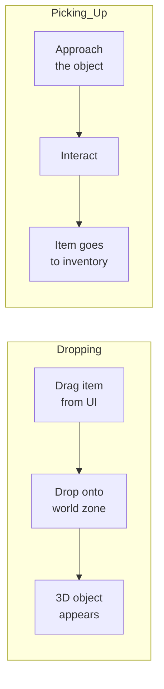
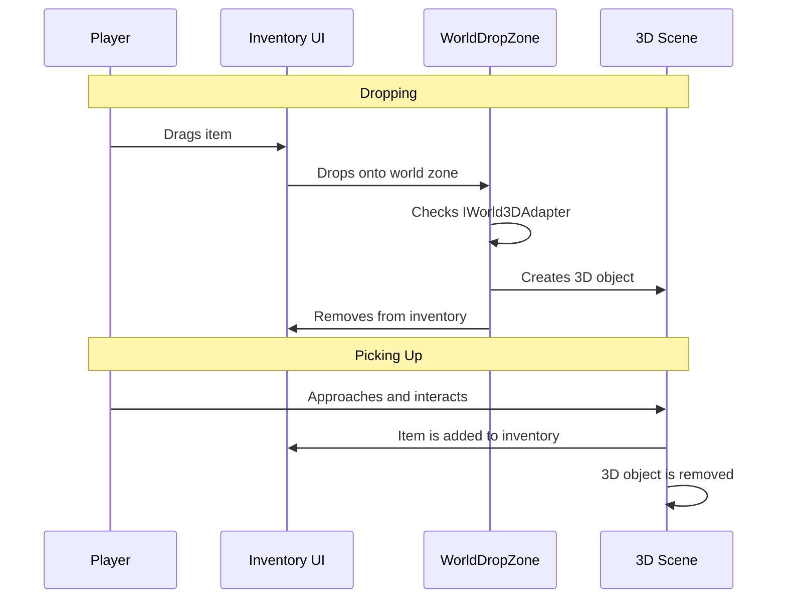

# 3D World

The 3D world system allows dropping items from the UI inventory into a three-dimensional scene and picking them back up. An item dropped into the world becomes a 3D object; a picked-up item returns to the inventory.

---

## How It Works



---

## Components

| Component | Purpose |
|-----------|---------|
| **WorldDropZone** | UI area for dropping items into the world. On drop, creates a 3D object and removes the item from the inventory |
| **WorldItem** | Component on a 3D object in the world. Stores a reference to `IInventoryItem` and the count |
| **IWorld3DAdapter** | Interface on the item: links an inventory item to its 3D prefab |

---

## Setup

### 1. Implement `IWorld3DAdapter` in your item

```csharp
[CreateAssetMenu(menuName = "Game/Item With 3D")]
public class GameItemSO : ScriptableObject, IInventoryItem, IWorld3DAdapter
{
    [SerializeField] private string _name;
    [SerializeField] private Sprite _icon;
    [SerializeField] private GameObject _worldPrefab;

    public string DisplayName => _name;
    public Sprite Icon => _icon;
    public GameObject WorldPrefab => _worldPrefab;
}
```

### 2. Add WorldDropZone

Create a UI panel (Image with RectTransform) and add the `WorldDropZone` component. Configure:

- **Spawn Point** --- Transform point where 3D objects will appear.
- **Randomize Position** --- add random offset on spawn.
- **Random Radius** --- scatter radius.
- **Area Highlight** --- Image for highlighting the zone on hover (green = can drop, red = cannot).

### 3. Add WorldItem to 3D prefabs

On the 3D object prefab, add the `WorldItem` component. If you forget --- `WorldDropZone` will add it automatically on spawn.

To pick up items back into the inventory, implement your own interaction logic: on contact with the player, read `worldItem.itemData` and `worldItem.count`, add to the inventory, and destroy the 3D object.

---

## Full Cycle



---

## Implementation Details

- `WorldDropZone` checks **every** item in the drag context via `IWorld3DAdapter`. If even one item does not have a 3D prefab --- the drop is rejected.
- For stacks, each instance is spawned as a separate object with a slight offset.
- `WorldDropZone` implements the `IDropTarget` interface directly --- it does not need a dummy inventory.
- Zone highlighting works automatically: green if the item can be dropped, red if it cannot.

---

## Class Reference

| Class | Role |
|-------|------|
| `WorldDropZone` | UI drop zone: creates 3D objects on drop |
| `WorldItem` | Component on a 3D object: stores item data |
| `IWorld3DAdapter` | Interface: links an item to a 3D prefab |
