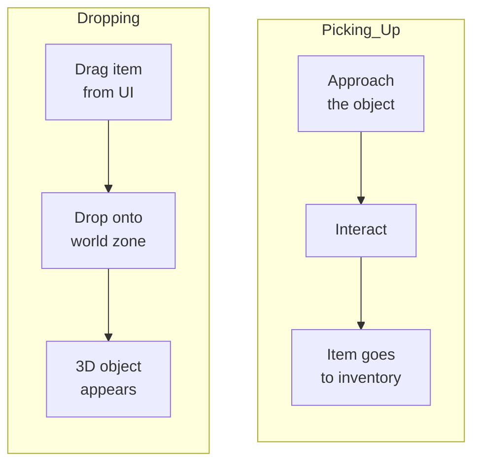
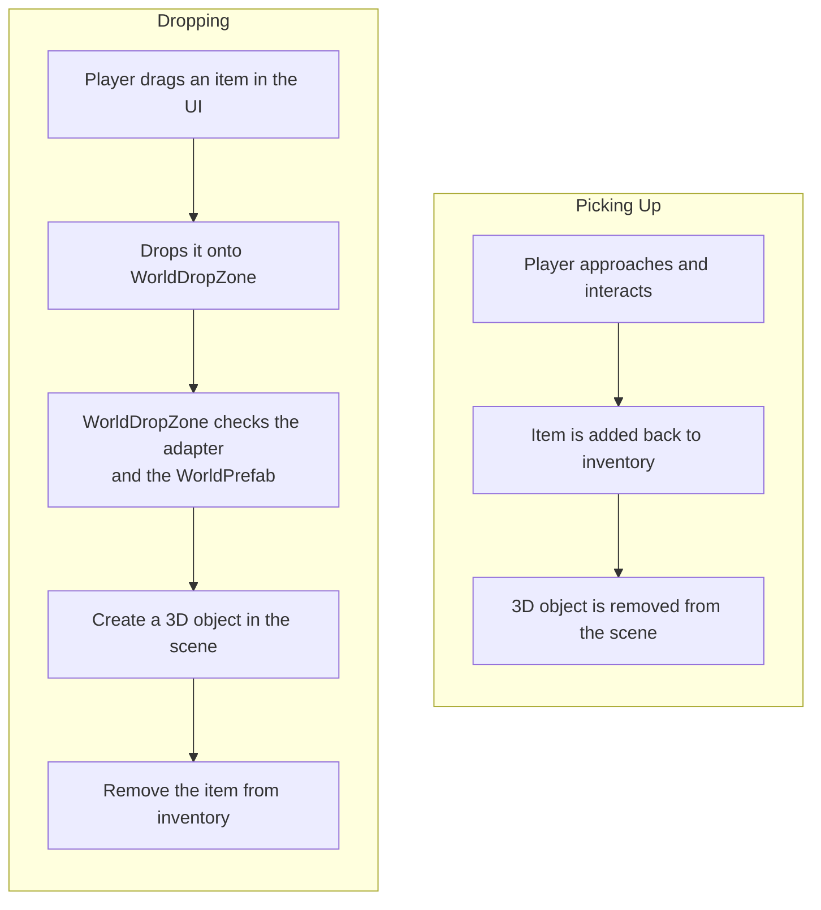

# 3D World

Esta integración permite soltar items desde el inventario de UI a una escena 3D y volver a recogerlos. En el paquete actual está implementada como ejemplo en `Demo2 Loot`: `WorldDropZone` y `WorldItem` viven dentro de `Examples`, no en el core runtime.

---

## Cómo funciona



---

## Componentes

| Componente | Propósito |
|-----------|---------|
| **WorldDropZone** | Área de UI para soltar items al mundo. Al hacer drop, crea un objeto 3D y elimina el item del inventario |
| **WorldItem** | Componente en un objeto 3D del mundo. En la demo guarda una referencia a `ItemExampleWith3DSO` |
| **ItemAdapterSoWith3DAdapter** | Adapter de la demo que expone un prefab 3D mediante su propiedad `WorldPrefab` |

---

## Configuración

### 1. Usa un adapter con `WorldPrefab`

```csharp
public class ItemAdapterSoWith3DAdapter : IItemAdapter, IFilterable
{
    public readonly ItemExampleWith3DSO item;

    public string DisplayName => item.ItemName;
    public Sprite Icon => item.Icon;
    public GameObject WorldPrefab => item.WorldPrefab.gameObject;
}
```

En la implementación actual, `WorldDropZone` de `Demo2 Loot` acepta específicamente `ItemAdapterSoWith3DAdapter`. Si tu proyecto usa otro tipo de adapter, actualiza `CanAcceptEntry` y la lógica de spawn en consecuencia.

### 2. Añade WorldDropZone

Crea un panel de UI (Image con RectTransform) y añade el componente `WorldDropZone`. Configura:

- **Spawn Point** — punto `Transform` donde aparecerán los objetos 3D.
- **Randomize Position** — añade un offset aleatorio al hacer spawn.
- **Random Radius** — radio de dispersión.
- **Area Highlight** — Image para resaltar el área al hacer hover (verde = puede soltarse, rojo = no puede).

### 3. Añade WorldItem a los prefabs 3D

En el prefab del objeto 3D, añade el componente `WorldItem`. Si lo olvidas, `WorldDropZone` lo añadirá automáticamente al hacer spawn.

Para recoger items de vuelta al inventario, implementa tu propia lógica de interacción: al entrar en contacto con el jugador, lee `worldItem.Item`, añádelo al inventario y destruye el objeto 3D.

---

## Ciclo completo



---

## Detalles de implementación

- `WorldDropZone` hereda de [`DropAreaBase`](../architecture/drop-areas.md) usando el patrón **simple consumption**: sobrescribe `CanAcceptEntry` y `ProcessEntry`. La eliminación del source y el resaltado del área los gestiona automáticamente la clase base.
- `WorldDropZone` comprueba **cada** item dentro del drag context: en la demo debe ser un `ItemAdapterSoWith3DAdapter` con `WorldPrefab` no nulo. Si aunque sea un item falla esa comprobación, el drop se rechaza.
- En stacks, cada instancia se crea como un objeto separado con un pequeño desplazamiento.
- El resaltado del área funciona automáticamente: verde si el item puede soltarse, rojo si no.

---

## Referencia de clases

| Clase | Rol |
|-------|------|
| `DropAreaBase` | Clase base para drop areas (ver [Drop Areas](../architecture/drop-areas.md)) |
| `WorldDropZone` | Zona de drop de UI: crea objetos 3D al soltar |
| `WorldItem` | Componente en un objeto 3D: en la demo guarda `ItemExampleWith3DSO` |
| `ItemAdapterSoWith3DAdapter` | Adapter de la demo con acceso a `WorldPrefab` |

