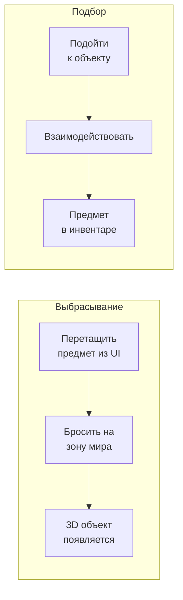
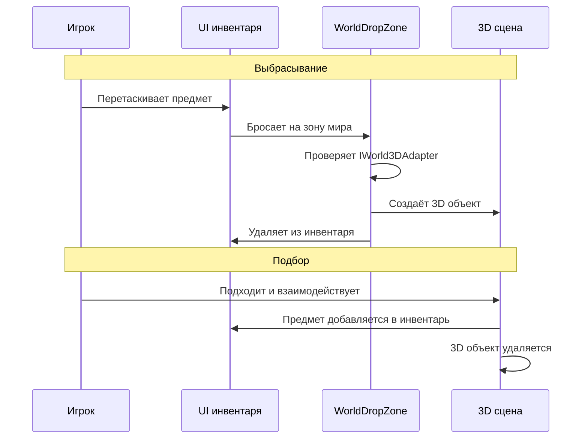

# 3D мир

Система 3D-мира позволяет выбрасывать предметы из UI-инвентаря в трёхмерную сцену и подбирать их обратно. Предмет, выброшенный в мир, становится 3D-объектом; подобранный --- возвращается в инвентарь.

---

## Как это работает



---

## Компоненты

| Компонент | Назначение |
|-----------|------------|
| **WorldDropZone** | UI-область для сброса предметов в мир. При дропе создаёт 3D-объект и удаляет предмет из инвентаря |
| **WorldItem** | Компонент на 3D-объекте в мире. Хранит ссылку на `IItemAdapter` и количество |
| **IWorld3DAdapter** | Интерфейс на предмете: связывает инвентарный предмет с его 3D-префабом |

---

## Настройка

### 1. Реализуйте `IWorld3DAdapter` в вашем предмете

```csharp
[CreateAssetMenu(menuName = "Game/Item With 3D")]
public class GameItemSO : ScriptableObject, IItemAdapter, IWorld3DAdapter
{
    [SerializeField] private string _name;
    [SerializeField] private Sprite _icon;
    [SerializeField] private GameObject _worldPrefab;

    public string DisplayName => _name;
    public Sprite Icon => _icon;
    public GameObject WorldPrefab => _worldPrefab;
}
```

### 2. Добавьте WorldDropZone

Создайте UI-панель (Image с RectTransform) и добавьте компонент `WorldDropZone`. Настройте:

- **Spawn Point** --- Transform-точка, где появятся 3D-объекты.
- **Randomize Position** --- добавить случайное смещение при спавне.
- **Random Radius** --- радиус разброса.
- **Area Highlight** --- Image для подсветки зоны при наведении (зелёный = можно бросить, красный = нельзя).

### 3. Добавьте WorldItem на 3D-префабы

На префабе 3D-объекта добавьте компонент `WorldItem`. Если забудете --- `WorldDropZone` добавит его автоматически при спавне.

Для подбора обратно в инвентарь реализуйте свою логику взаимодействия: при контакте с игроком считайте `worldItem.itemData` и `worldItem.count`, добавьте в инвентарь и уничтожьте 3D-объект.

---

## Полный цикл



---

## Детали реализации

- `WorldDropZone` наследует [`DropAreaBase`](../architecture/drop-areas.md) и использует паттерн **простого потребления** --- переопределяет `CanAcceptEntry` и `ProcessEntry`. Удаление предметов из источника и подсветка зоны обрабатываются базовым классом автоматически.
- `WorldDropZone` проверяет **каждый** предмет в контексте перетаскивания через `IWorld3DAdapter`. Если хоть один предмет не имеет 3D-префаба --- дроп отклоняется.
- Для стаков каждый экземпляр спавнится отдельным объектом с небольшим смещением.
- Подсветка зоны работает автоматически: зелёная если предмет можно бросить, красная если нельзя.

---

## Справочник классов

| Класс | Роль |
|-------|------|
| `DropAreaBase` | Базовый класс для зон дропа (см. [Зоны дропа](../architecture/drop-areas.md)) |
| `WorldDropZone` | UI-зона сброса: создаёт 3D-объекты при дропе |
| `WorldItem` | Компонент на 3D-объекте: хранит данные предмета |
| `IWorld3DAdapter` | Интерфейс: связывает предмет с 3D-префабом |
