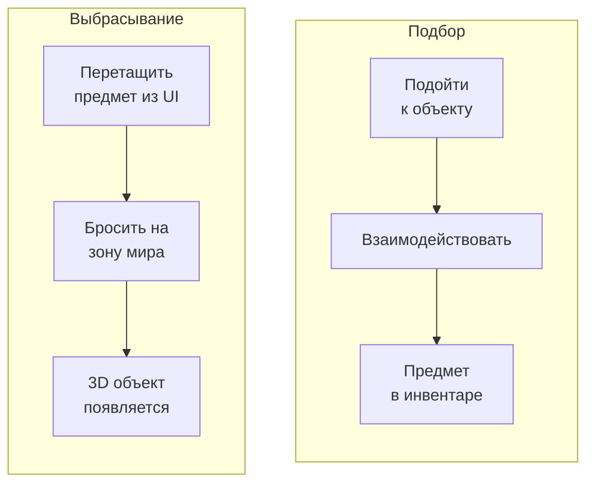
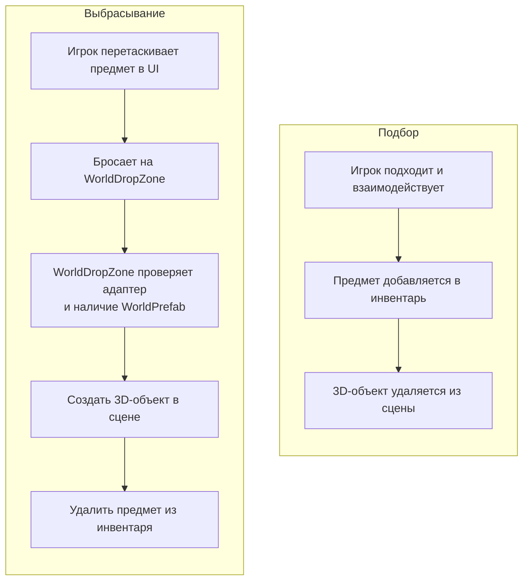

# 3D мир

Эта интеграция позволяет выбрасывать предметы из UI-инвентаря в трёхмерную сцену и подбирать их обратно. В текущем пакете она реализована как пример из `Demo2 Loot`: `WorldDropZone` и `WorldItem` находятся в папке `Examples`, а не в core-части ассета.

---

## Как это работает



---

## Компоненты

| Компонент | Назначение |
|-----------|------------|
| **WorldDropZone** | UI-область для сброса предметов в мир. При дропе создаёт 3D-объект и удаляет предмет из инвентаря |
| **WorldItem** | Компонент на 3D-объекте в мире. В демо хранит ссылку на `ItemExampleWith3DSO` |
| **ItemAdapterSoWith3DAdapter** | Demo-адаптер, который связывает предмет с 3D-префабом через свойство `WorldPrefab` |

---

## Настройка

### 1. Используйте адаптер с `WorldPrefab`

```csharp
public class ItemAdapterSoWith3DAdapter : IItemAdapter, IFilterable
{
    public readonly ItemExampleWith3DSO item;

    public string DisplayName => item.ItemName;
    public Sprite Icon => item.Icon;
    public GameObject WorldPrefab => item.WorldPrefab.gameObject;
}
```

В текущей реализации `WorldDropZone` из `Demo2 Loot` принимает именно `ItemAdapterSoWith3DAdapter`. Если в проекте нужен другой тип адаптера, нужно адаптировать проверку в `CanAcceptEntry` и логику спавна.

### 2. Добавьте WorldDropZone

Создайте UI-панель (Image с RectTransform) и добавьте компонент `WorldDropZone`. Настройте:

- **Spawn Point** --- Transform-точка, где появятся 3D-объекты.
- **Randomize Position** --- добавить случайное смещение при спавне.
- **Random Radius** --- радиус разброса.
- **Area Highlight** --- Image для подсветки зоны при наведении (зелёный = можно бросить, красный = нельзя).

### 3. Добавьте WorldItem на 3D-префабы

На префабе 3D-объекта добавьте компонент `WorldItem`. Если забудете --- `WorldDropZone` добавит его автоматически при спавне.

Для подбора обратно в инвентарь реализуйте свою логику взаимодействия: при контакте с игроком считайте `worldItem.Item`, добавьте предмет в инвентарь и уничтожьте 3D-объект.

---

## Полный цикл



---

## Детали реализации

- `WorldDropZone` наследует [`DropAreaBase`](../architecture/drop-areas.md) и использует паттерн **простого потребления** --- переопределяет `CanAcceptEntry` и `ProcessEntry`. Удаление предметов из источника и подсветка зоны обрабатываются базовым классом автоматически.
- `WorldDropZone` проверяет **каждый** предмет в контексте перетаскивания: в демо это должен быть `ItemAdapterSoWith3DAdapter` с ненулевым `WorldPrefab`. Если хоть один предмет не подходит --- дроп отклоняется.
- Для стаков каждый экземпляр спавнится отдельным объектом с небольшим смещением.
- Подсветка зоны работает автоматически: зелёная если предмет можно бросить, красная если нельзя.

---

## Справочник классов

| Класс | Роль |
|-------|------|
| `DropAreaBase` | Базовый класс для зон дропа (см. [Зоны дропа](../architecture/drop-areas.md)) |
| `WorldDropZone` | UI-зона сброса: создаёт 3D-объекты при дропе |
| `WorldItem` | Компонент на 3D-объекте: в демо хранит `ItemExampleWith3DSO` |
| `ItemAdapterSoWith3DAdapter` | Demo-адаптер с доступом к `WorldPrefab` |
