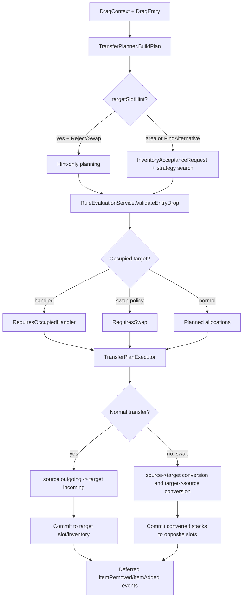

# Transfer Pipeline Architecture

**Last Updated**: 2026-04-04

Документ описывает текущую архитектуру drop/transfer pipeline, включая batch transfer, swap и target-aware preview.

## Зачем это сделано

Старая логика переноса была распределена между manager/UI-target кодом и плохо масштабировалась для:
- single vs batch
- partial vs atomic
- occupied target
- swap
- cross-inventory adapter conversion
- area-drop preview без конкретного target slot

Текущая схема разделяет ответственность:

1. `DropPolicy` определяет blocked-target behavior, partial handling, batch mode и alternative placement
2. `TransferPlanner` строит план без мутаций
3. `TransferPlanExecutor` применяет план, выполняет placement helpers и rollback
4. `InventoryDropProcessor` связывает UI drop-target с planner/executor

## Основные компоненты

### DropPolicy

Файл: `Scripts/Core/DropPolicy.cs`

Состоит из трёх уровней:
- `DropRequestPolicy`
  - временный override для конкретной операции
  - может задать `BlockedTargetBehavior`, `AlternativePlacementMode`, `AllowPartial`
- `DropPolicySettings`
  - inventory-level defaults в `UniversalInventory`
  - содержит `BlockedTargetBehavior`, `AllowMergeOnDrop`, `AllowPartial`, `BatchMode`, `AlternativePlacementMode`
- `ResolvedDropPolicy`
  - итоговый planner-facing policy после resolution

`BlockedTargetBehavior`:
- `Reject`
- `Swap`
- `FindAlternative`

`AlternativePlacementMode`:
- `MergeFirst`
- `EmptyFirst`
- `MergeOnly`
- `EmptyOnly`

### TransferPlanner

Файл: `Scripts/Inventories/TransferPlanner.cs`

Роль:
- планирует размещение без изменения данных
- использует `TransferItemConversionUtility` для target-side preview item и preview stack
- считает capacity через `InventoryAcceptanceRequest` только там, где реально нужен inventory-wide search
- использует `VirtualSlotState` для batch planning
- валидирует кандидатов через `RuleEvaluationService`
- может пометить entry как `RequiresOccupiedHandler` (приоритет над swap)
- может пометить entry как `RequiresSwap`

Важно:
- direct slot drop с `targetSlotHint != null` и `BlockedTarget != FindAlternative` не должен сканировать остальные слоты инвентаря
- inventory-wide `GetAcceptableCount()` остаётся только для area-drop, deferred placement и сценариев поиска альтернативных слотов

Порядок rule evaluation:
- global rules
- inventory rules
- DataBinding rules/hooks
- slot rules

Связанные helper-объекты:
- `EntryPlanningOperation`
- `VirtualSlotState`

### TransferPlanExecutor

Файл: `Scripts/Inventories/TransferPlanExecutor.cs`

Роль:
- исполняет `TransferPlan`
- выполняет обычные переносы через внутренние execution helpers
- исполняет occupied handler ветку (`RequiresOccupiedHandler`)
- исполняет swap-ветку
- поддерживает rollback в atomic mode
- откладывает события до успешного завершения плана
- уведомляет DataBinding напрямую через `HandleItemAdded()` / `HandleItemRemoved()`
- публикует `OnItemAdded` / `OnItemRemoved` для внешних подписчиков

Важно:
- для обычных переносов executor dispatch-ит remove/add на основе итогового `InventoryTransferResult`
- remove использует `SourceItem`
- add использует `TargetItem`
- direct slot execution с concrete `targetSlot` не должен повторно вызывать inventory-wide `GetAcceptableCount()`
- cross-inventory swap больше не является raw exchange стэков: executor снимает копии обоих стэков, конвертирует их в обе стороны и только потом коммитит в противоположные слоты
- swap add/remove events публикуют `before` для remove и `after` для add
- обычные split/merge path теперь переносят реальные списки адаптеров внутри `ItemStack`, а не только абстрактное количество
- event payloads и `InventoryTransferResult` по-прежнему публикуют representative adapter + count

Это критично для корректной работы adapter conversion между разными инвентарями.

### Transfer Execution Models

Файл: `Scripts/Inventories/InventoryTransferService.cs`

Роль:
- хранит `InventoryTransferRequest`
- хранит `InventoryTransferResult`
- используется executor'ом как transport-модель для обычного allocation transfer

Связанные helper-объекты исполнения:
- `TargetPlacementOperation`
- `SlotRelocationService`

### InventoryAcceptanceRequest

Файл: `Scripts/Inventories/InventoryAcceptanceRequest.cs`

Роль:
- описывает preview-проверку в контексте конкретного drag entry
- содержит target inventory, preview item, desired count, source entry и исходный `DragContext`
- позволяет strategy-проверкам валидировать реальные candidate slots, а не абстрактный item без контекста

### Item Conversion

Current conversion ownership:
- `InventoryDataBindingBase.CreateItemConverter()` задаёт converter для конкретного инвентаря
- `IdentityItemAdapterConverter` используется по умолчанию
- `TransferItemConversionUtility` является общей точкой orchestration для preview, execution и swap conversion
- planner/executor не должны дублировать source/target conversion вручную

### InventoryDropProcessor

Файл: `Scripts/Inventories/InventoryDropProcessor.cs`

Это boundary между UI target layer и transfer core.

Роль:
- принимает `DragContext`
- резолвит effective target inventory/slot
- резолвит effective `DropPolicy`
- строит plan через `TransferPlanner`
- исполняет plan через `TransferPlanExecutor`
- возвращает `DropResult` / `TransferExecutionSummary`

### Порядок resolution policy

1. action или drop target может передать `DropRequestPolicy`
2. `InventoryDropProcessor` объединяет request с bound target override, если он есть
3. если target inventory реализует `IDropPolicyProvider`, provider строит `ResolvedDropPolicy`
4. planner получает только уже resolved policy

### Порядок обработки одного entry

1. planner валидирует source entry и target-side preview item
2. если есть `target slot`, planner сначала работает только с ним
3. если в target вошло всё, entry успешен
4. если вошла часть:
   - `AllowPartial = false` -> fail
   - `AllowPartial = true` -> partial success
   - остаток ищет другие слоты только если `BlockedTargetBehavior = FindAlternative`
5. если в target не вошло ничего:
   - **сначала** проверяется `DataBinding.CanHandleOccupiedSlotDrop(entry, slot)` — если true, entry планируется как `RequiresOccupiedHandler`
   - `Reject` -> fail (если occupied handler не обрабатывает)
   - `Swap` -> planner строит swap entry (если occupied handler не обрабатывает)
   - `FindAlternative` -> стратегия перечисляет alternative slots (если occupied handler не обрабатывает)
6. для same-inventory `FindAlternative` не перераскладывает предметы по другим слотам: предмет остаётся на месте, если target не подошёл

## Visual Flow



## Preview flow

### Area drop / planner preview

1. Source item preview-конвертируется в target item через `TransferItemConversionUtility`
2. Создаётся `InventoryAcceptanceRequest`
3. Strategy вызывает `PassesRules(..., request)` для candidate slots
4. `UniversalInventory.CanAcceptByRules(...)` пересобирает корректный preview `DragContext`

Это устраняет необходимость писать ad-hoc preview guards в feature bindings.

## Интеграция с UI и manager

### DragAndDropManager

Файл: `Scripts/DragAndDropManager.cs`

Manager:
- хранит активный drag context
- резолвит верхний `IDropTarget`
- берёт у target `IDropProcessor`
- вызывает `CanAcceptDrop` и `ProcessDrop`
- публикует swap callbacks (`RaiseSwapAttempting`, `RaiseSwapCompleted`)
- при старте drag использует копию подмножества адаптеров исходного стака, а не реконструкцию только по count

### Drop targets

Актуальные target-компоненты:
- `Scripts/Interaction/SlotInputAdapter.cs`
- `Scripts/UI/InventoryDropArea.cs`
- `Scripts/World3D/WorldDropZone.cs`

Все они реализуют `IDropTarget` и предоставляют `IDropProcessor`.

Для inventory UI используется `InventoryDropProcessor`.

## Occupied Slot Handler

Позволяет DataBinding перехватить дроп на занятый слот **до** проверки swap/findAlternative.

Виртуальные методы в `InventoryDataBindingBase`:
```csharp
protected virtual bool CanHandleOccupiedSlotDrop(DragEntry entry, ISlot occupiedSlot);
protected virtual bool ExecuteOccupiedSlotDrop(DragEntry entry, ISlot occupiedSlot);
```

Flow:
1. Planner: target slot занят, allocation = 0
2. `targetInventory.CheckOccupiedSlotDrop(entry, slot)` → `DataBinding.CanHandleOccupiedSlotDrop()`
3. Если `true` — entry планируется как `RequiresOccupiedHandler`
4. Executor: `targetInventory.ExecuteOccupiedSlotDrop(entry, slot)` → `DataBinding.ExecuteOccupiedSlotDrop()`
5. Реализация сама отвечает за mutation (добавить в цель, очистить source слот)
6. Если `CanHandleOccupiedSlotDrop` вернул `false` — pipeline продолжает обычную логику (swap/findAlternative/reject)

Пример: Demo5 Containers использует этот хук для вкладывания предметов в контейнер при дропе на него.

## Swap flow

1. Planner сначала пытается построить обычный allocation
2. Если allocation невозможен — сначала проверяется occupied handler (см. выше)
3. Если occupied handler не обрабатывает и `BlockedTargetBehavior = Swap`, entry получает `RequiresSwap`
4. Executor:
   - валидирует оба направления через rules на target-side converted preview stacks
   - вызывает `SwapAttempting`
   - снимает копии обоих стэков
   - конвертирует `source -> target` и `target -> source`
   - коммитит уже конвертированные стэки в противоположные слоты
   - откладывает `SwapCompleted` до конца успешного выполнения

Текущие ограничения:
- swap включен для одиночного entry и полного source stack
- batch swap как отдельный orchestration mode не реализован
- snapshot/sort/save-load path всё ещё нужно держать в уме отдельно: не каждый legacy path уже instance-aware

## Что это даёт

- единое поведение для slot-drop и area-drop
- тестируемую planning фазу
- rollback-safe atomic batch execution
- корректную target-side adapter conversion уже на этапе preview
- меньше дублирования между swap и обычным transfer
- тонкий UI target code

## Рекомендованные проверки

1. `TransferPlanner` для policy matrix
2. `TransferPlanExecutor` atomic rollback и deferred events
3. `InventoryDropProcessor` effective policy resolution
4. area-drop и slot-drop должны давать одинаковый результат при одинаковом `DropPolicy`
5. cross-inventory adapter conversion должна давать корректный `TargetItem` в add event
6. same-inventory `FindAlternative` не должен перераскладывать предметы
7. `SeparableStacks` должен уважать `AllowMergeOnDrop` и `AlternativePlacementMode`
